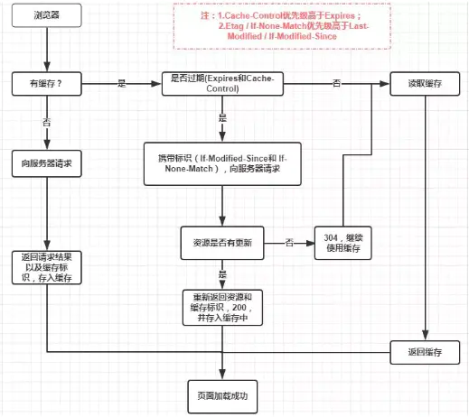

# 2021-03-29

面试题整理

### 性能优化
1. 图片懒加载 组件懒加载
2. 减少请求次数 雪碧图 打包合并
3. SSR服务端渲染
4. Cache //ServiceCache MenoryCache DiskCache PushCache
5. CND
6. Gzip压缩

lrsccg  
(lazy,请求,ssr,cache,cdn,gzip)

### 为什么要把图片和css等静态资源放在单独的域名下
https://zhidao.baidu.com/question/628020615953353004.html  
https://www.jianshu.com/p/4cf3b6d6b50a

1. 有利于cpu负载和带宽均衡 ??
2. CDN缓存更方便 (可缓存的资源，缓存逻辑？)
3. 突破浏览器并发限制
4. Cookieless, 节省带宽，尤其是上行带宽 一般比下行要慢
5. 防止不必要的安全问题(用户上传内容(ucg)产生安全问题)
6. 数据做了划分，甚至切到了不同的物理集群，通过子域名来分流比较省事

bccud  
(并发,cdn,cookie,ucg,分割流量)

### 浏览器缓存
https://www.jianshu.com/p/54cc04190252
https://segmentfault.com/a/1190000017185195

#### 2. 缓存位置
1. Service Worker
2. Memory Cache
3. Disk Cache
4. Push Cache

1. Service Worker
    - Service拦截数据 必须HTTPS保证数据安全 浏览器独立线程
    - 需要 注册 监听？ // 用起来有点复杂
    - 当 Service Worker 没有命中缓存的时候，我们需要去调用 fetch 函数获取数据，这时不管实际是Memory Cache 中还是从网络请求中获取的数据显示的都是从 Service Worker获取的数据
2. Memory Cache
    - 一旦我们关闭 **Tab** 页面就会释放
    - MC 缓存资源里比较重要的一块是**preloader**相关指令（例如<link rel="prefetch">）下载的资源。(preloader不会被解析JS/CSS的动作阻塞)
    - 内存缓存在缓存资源时并不关心返回资源的HTTP缓存头Cache-Control是什么值，同时资源的匹配也并非仅仅是对<u>URL做匹配</u>，还可能会对<u>Content-Type，CORS</u>等其他特征做校验。
3. Disk Cache
    - 根据 HTTP Herder 中的字段判断是否需要缓存，是否过期
    - 对于大文件来说，大概率是不存储在内存中的，反之优先
    - 当前系统内存使用率高的话，文件优先存储进硬盘
4. Push Cache
    - 当以上三种缓存都没有命中时，它才会被使用 //怎么用？
    - **HTTP/2**(国内不够普及 2018) 中的内容 只在**会话（Session）**中存在 5分钟左右
    - 所有的资源都能被推送，并且能够被缓存,但是 Edge 和 Safari 浏览器支持相对比较差
    - 可以推送 no-cache 和 no-store 的资源
    - 一旦连接被关闭，Push Cache 就被释放
    - 多个页面可以使用同一个HTTP/2的连接，也就可以使用同一个Push Cache。这主要还是依赖浏览器的实现而定，出于对性能的考虑，有的浏览器会对相同域名但不同的tab标签使用同一个HTTP连接。
    - Push Cache 中的缓存只能被使用一次
    - 浏览器可以拒绝接受已经存在的资源推送
    - 你可以给其他域名推送资源

强缓存和协商缓存
通过设置 HTTP Header 来实现的。

1. 检查缓存标识（第一次请求没有记录）
2. HTTP请求 得到缓存标识和数据
3. 保存缓存标识和数据

ps service worker 是什么  
https://zhuanlan.zhihu.com/p/115243059  
navigator
- 基于web worker
- 由事件驱动的,具有生命周期
- 可以访问cache和indexDB
- 让开发者自己控制管理缓存的内容以及版本

ps 使用 Fetch  
https://developer.mozilla.org/zh-CN/docs/Web/API/Fetch_API/Using_Fetch

#### 4. 强缓存
强缓存通过设置两种 HTTP Header 实现：Expires 和 Cache-Control。
1. Expires 过期时间
    - **HTTP/1** 识别的是客户端本地时间 旧版本兼容用
2. Cache-Control
    - **HTTP/1.1**
    - Cache-Control:max-age=300 （s）
    - 指令: public private max-age= s-maxage= no-store no-cache max-stale min-fresh

- public 客户端 代理服务器缓存
- private 仅客户端缓存
- no-cache 协商缓存 不使用Cache-Control控制缓存，而是使用 Etag 或者Last-Modified字段来控制缓存
- no-store 即不使用强制缓存，也不使用协商缓存
- max-age 缓存有效时长
- s-maxage CDN/代理服务器缓存时长
- max-stale 客户端愿意接收一个已经过期了的响应
- min-fresh 不接受太新鲜的数据？

#### 5. 协商存
强制缓存失效(过期)后，浏览器携带缓存标识向服务器发起请求  
协商缓存可以通过设置两种 HTTP Header 实现：Last-Modified 和 ETag 。
- 协商缓存生效，返回304和Not Modified  
    
- 协商缓存失效，返回200和请求结果  
    

// todo 第一步和http请求是什么意思

##### 1. Last-Modified和If-Modified-Since
- first get:  
    Browser <=====< Last-Modified + 资源 <===== Servers  
- next get:  
    Browser =====> If-Modified-Since >=====> Servers  
    - 相同  
        Browser <=====< 304 <===== Servers
    - 不同  
        Browser <=====< 200 + 资源 <===== Servers  

- 如果本地打开缓存文件，即使没有对文件进行修改，但还是会造成 Last-Modified 被修改
- 因为 Last-Modified 只能以秒计时，可能不能正确获取新资源

##### 2. ETag和If-None-Match
Etag是服务器响应请求时，返回当前**资源文件的一个唯一标识**(由服务器生成)，
- first get:  
    Browser <=====< ETag和If + 资源 <===== Servers  
- next get:  
    Browser =====> If-None-Match >=====> Servers  

- ETag 精度高 消耗性能 优先级高

#### 6. 缓存机制
- 强制缓存优先于协商缓存进行，若强制缓存(Expires和Cache-Control)生效则直接使用缓存，若不生效则进行协商缓存(Last-Modified / If-Modified-Since和Etag / If-None-Match)，
- 协商缓存由服务器决定是否使用缓存，
    - 若协商缓存失效，那么代表该请求的缓存失效，返回200，重新返回资源和缓存标识，再存入浏览器缓存中；
    - 生效则返回304，继续使用缓存。

#### 7. 实际场景应用缓存策略

1. 频繁变动的资源 Cache-Control: no-cache
2. Cache-Control: max-age=31536000  
    需要在文件名(或者路径)中添加 <u>hash</u>， <u>版本号等动态字符</u>，从而达到更改引用 URL 的目的,让缓存的资源失效

#### 8. 用户行为对浏览器缓存的影响

### HTTP 请求
**请求**
https://developer.mozilla.org/zh-CN/docs/Web/HTTP/Overview#请求

1. Method Path Version
    - Method: \[GET Post PUT DELETE OPTION ...\]
    - Path: 路径
    - Version 协议版本
2. HOST 主机域名
3. cookie Set-Cookie cookie2 ???
4. User-Agent Referer Referer-Policy
5. 缓存 Expires Cache-Control Age
6. 内容协商 Accept(MIME type) Accept-Charset Accept-Encoding Accept-Langusge
7. 消息正文信息 Content-Length Content-Type Content_Encoding Content-Language

https://developer.mozilla.org/en-US/docs/Web/HTTP/Headers

**响应**
1. version stateCode stateMessage 
2. 其他与请求头类似

### 输入URL后发生了什么

https://zhuanlan.zhihu.com/p/80551769

大致流程
1. URL 解析
  - 1.url合法检查 2.HSTS 3.浏览器访问限制 4.缓存检查
2. DNS 查询
3. TCP 连接
4. 处理请求
5. 接受响应
6. 渲染页面

webpack打包过程  
vue数组直接改索引不会更新  
css实现排序  
Vue 的响应式原理中 Object.defineProperty 有什么缺陷？  
