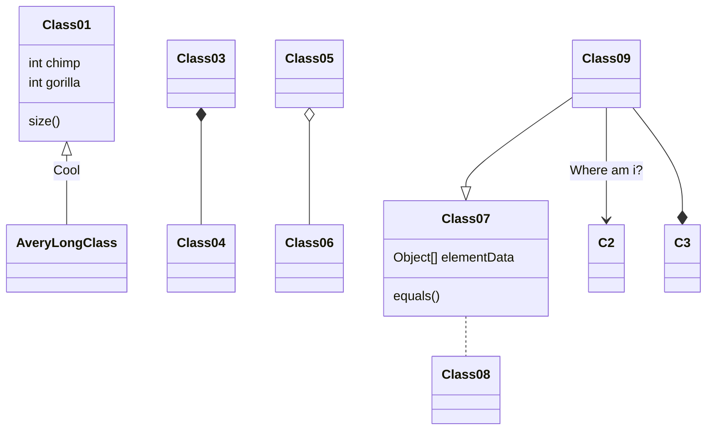

# 2021-05-20

- [Mermaid：如何在Markdown文本中添加流程图，附支持github的方法](https://www.it610.com/article/1345295872950349824.htm)  
    draw.io Visio Mermaid PlantUML
- [github snippet 用markDown画流程图](https://blog.csdn.net/nihaoa50/article/details/79420349)

Graphviz

[template](http://web.h3399.cn/template.htm)  
[ShadowRoot](https://developer.mozilla.org/zh-CN/docs/Web/API/ShadowRoot)  
[vscode-markdown样式](https://github.com/raycon/vscode-markdown-style)  
[ipc-message](https://segmentfault.com/q/1010000016590009/a-1020000016753513)

<!-- <webview partition="webview" webpreferences="contextIsolation=yes" class="webview ready" preload="file:///e:/Users/LGame/AppData/Local/Programs/Microsoft VS Code/resources/app/out/vs/workbench/contrib/webview/electron-browser/pre/electron-index.js" src="vscode-webview://cec446c4-f045-4d33-8fa6-16b53187f34b/electron-browser-index.html?platform=electron&amp;id=cec446c4-f045-4d33-8fa6-16b53187f34b&amp;vscode-resource-origin=https%3A%2F%2Fcec446c4-f045-4d33-8fa6-16b53187f34b.vscode-webview-test.com" style="width: 100%; height: 100%; outline: 0px;"></webview> -->