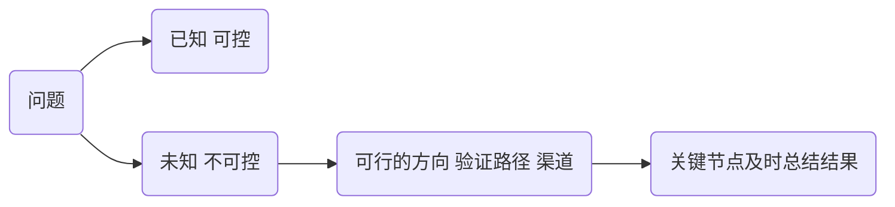

## 2022-05-12

log文件格式  
[log4net](https://logging.apache.org/log4net/)
[vscode ansi](https://marketplace.visualstudio.com/items?itemName=iliazeus.vscode-ansi)

-[ ] "node-sass": "npm:dart-sass@^1.25.0",

## 2022-05-23

- [【CNN常见模型4】经典CNN模型汇总](https://zhuanlan.zhihu.com/p/486841254)
  - VGG

聚焦问题 深入和化时间熟练 逐个做出结果 不断累积
