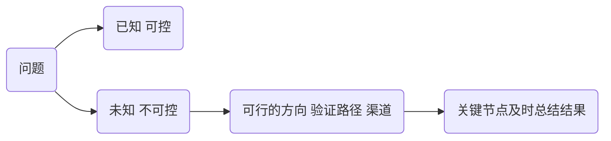

## 2022-05-12

log文件格式  
[log4net](https://logging.apache.org/log4net/)
[vscode ansi](https://marketplace.visualstudio.com/items?itemName=iliazeus.vscode-ansi)


-[ ] "node-sass": "npm:dart-sass@^1.25.0",

## 2022-05-23

- [【CNN常见模型4】经典CNN模型汇总](https://zhuanlan.zhihu.com/p/486841254)
  - VGG



聚焦问题 深入和化时间熟练 逐个做出结果 不断累积


## 2022-05-30
### vue 模板项目原理 

### vue add 插件原理
[vuecli 插件和 Preset](https://cli.vuejs.org/zh/guide/plugins-and-presets.html#%E6%8F%92%E4%BB%B6)  
[vuecli 插件开发指南](https://cli.vuejs.org/zh/dev-guide/plugin-dev.html)


#### 作用
1. 修改webbpack配置 增加webpack 插件等
2. 组件 vue-cli-service 命令 如集成测试命令
3. 增加 package.json 依赖
4. 修改项目文件 设置入口等
5. cli选项交互

#### 命名
vue-cli-plugin-&lt;name&gt;  
使用vue add <name> 或者 vue invoke <name> 安装

npm包的package.json 配置
```json
{
  "name": "vue-cli-plugin-apollo",
  "description": "vue-cli plugin to add Apollo and GraphQL",
  "repository": {
    "type": "git",
    "url": "git+https://github.com/Akryum/vue-cli-plugin-apollo.git"
  },
  "homepage": "https://github.com/Akryum/vue-cli-plugin-apollo#readme"
}
```
#### Generator
vue-cli preset 或者 vue add / vue invoke 安装时执行  
vue invoke: 已经安装过的插件配置参数后执行generator更新


