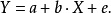
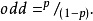

# 2019-01-11

## TF初探
[tensorflow-zh](https://github.com/jikexueyuanwiki/tensorflow-zh/blob/master/TOC.md)

### MNIST入门
[link](http://wiki.jikexueyuan.com/project/tensorflow-zh/tutorials/mnist_beginners.html)

展平图片会丢失二维信息，所以这样并不理想，但是暂时并不考虑。
<u>数据集</u>被分成两部分：60000行的训练数据集（mnist.train）和10000行的测试数据集（mnist.test）。在机器学习模型设计时必须有一个单独的测试数据集不用于训练而是用来评估这个模型的性能，从而把设计的模型推广到其他数据集上（**泛化**）。
每一个MNIST数据单元有两部分<u>组成</u>：我们把图片设为“xs”，把对应的标签设为“ys”
MNIST<u>训练数据集</u>中，mnist.train.images 是一个形状为 [60000, 784] 的张量，第一个维度数字用来索引图片，第二个维度数字用来索引每张图片中的像素点。在此张量里的每一个元素，都表示某张图片里的某个像素的强度值，值介于0和1之间。
<u>标签数据</u>是"one-hot vectors"。 一个one-hot向量除了某一位的数字是1以外其余各维度数字都是0。所以在此教程中，数字n将表示成一个只有在第n维度（从0开始）数字为1的10维向量。比如，标签0将表示成([1,0,0,0,0,0,0,0,0,0,0])

- softmax回归
softmax模型可以用来给不同的对象分配概率，即使使用其他模型，通常最后一步也需要用softmax来分配概率。

logistic分布和logistic回归有什么区别。logistic回归如何定义

---
## 回归模型
[回归模型](https://baike.baidu.com/item/%E5%9B%9E%E5%BD%92%E6%A8%A1%E5%9E%8B/4425684)

*分析数据建模归类的方法*
回归模型（regression model）对统计关系进行定量描述的一种数学模型。如多元线性回归的数学模型可以表示为y=β0+β1\*x+εi，
式中:
β0，β1，…，βp是p+1个待估计的参数，
εi是相互独立且服从同一正态分布N(0,σ2)的<u>随机变量(偏差)</u>，
y是随机变量；
x可以是随机变量，也可以是非随机变量,
βi称为<u>回归系数</u>，表征自变量对因变量影响的程度。

**回归模型**是一种预测性的建模技术，它研究的是因变量（目标）和自变量（预测器）之间的关系。这种技术通常用于预测分析，时间序列模型以及发现变量之间的因果关系。

回归模型重要的基础或者方法就是回归分析，回归分析是研究一个变量（被解释变量）关于另一个（些）变量（解释变量）的具体依赖关系的计算方法和理论，是建模和分析数据的重要工具。回归分析的几种常用方法 包含：
1. Linear Regression线性回归
线性回归使用最佳的拟合直线（也就是回归线）在因变量（Y）和一个或多个自变量（X）之间建立一种关系。
用一个方程式来表示它，即

其中a表示截距，
b表示直线的斜率，
e是误差项。
这个方程可以根据给定的预测变量（s）来预测目标变量的值。
2. Logistic Regression逻辑回归
逻辑回归是用来计算“事件=Success”和“事件=Failure”的概率。当因变量的类型属于二元（1 / 0，真/假，是/否）变量时，我们就应该使用逻辑回归。这里，Y的值从0到1，它可以用下方程表示。

上述式子中，p表述具有某个特征的概率。
> 描述二值输出概率的模型。输入值为(-∞,+∞)时，输出(即结果为真的概率)。
自变量接近-∞时为真的概率极小
自变量接近+∞时为真的概率极大
自变量在边缘时概率在两者之间
3. Polynomial Regression多项式回归
4. ...

---
## 概率论及logistic回归讲解
[概率论及logistic回归讲解](https://blog.csdn.net/gcaxuxi/article/details/77334806?utm_source=blogxgwz3)

### 概率论和统计
- 统计推断是根据观测的数据，反向思考其数据生成过程，即黑箱子的内部结构做出分析，并提出各种假设，这些假设都是概率模型
- 概率论是统计推断的基础，许多定理与结论，如大数定理、中心极限定理等保证了统计推断的合理性。
- 预测、分类、聚类、估计等，都是统计推断的特殊形式，强调对于数据生成过程的研究。

### 随机变量
**随机试验**（用E来表示）具有以下三个特征：
1. **重复** 试验可以在相同的条件下重复进行；
2. **预知** 试验可能出现的结果是事先预知的；
3. **唯一** 每次试验有且只有其中一个结果出现，**随机** 但在每次试验结束之前，不知道哪一个结果会出现。

在随机试验中，实验的结果中每一个可能发生的<u>事件</u>叫做实验的**样本点**（Sample point，通常用x来表示）；所有的样本点x1，x2，x3···，xn构成的集合叫做**样本空间**（Sample space，通常用S来表示）：
即 S={x1，x2，x3···，xn}
介绍了以上知识点后，我们假设随机试验E的样本空间为S，如果对每一个样本点e∈S，都有唯一的实数值X(e)与之对应，则称x(e)为S上的**随机变量** ，简记为X。
> 样本点x，样本空间S，S={x1，x2，x3···，xn} 。
对于样本空间内的样本点e∈S有唯一的实数值X(e)作为结果，简记X。

引入随机变量后，我们就可以用随机变量来描述**随机事件**，例如在一次投篮试验中，可用“X=1”表示事件“投中”，用“X=0”表示事件“未投中”；又如，用X表示一次共10名运动员投篮试验中投中的次数，则“X>5”表示事件“投中超过5球”。
>“X=1”、“X>5”随机事件的结果

---
 - [ ] TF
 - [ ] 油猴

 ---
 归一化
  softmax回归 logistic回归 sigmoid函数
