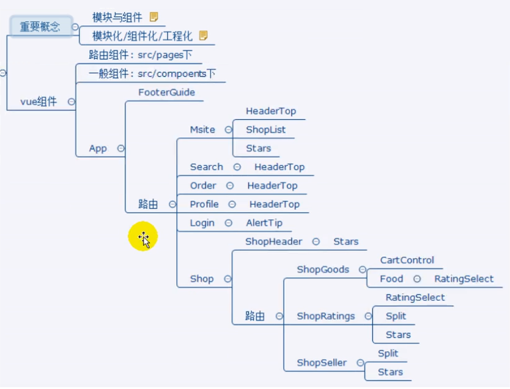
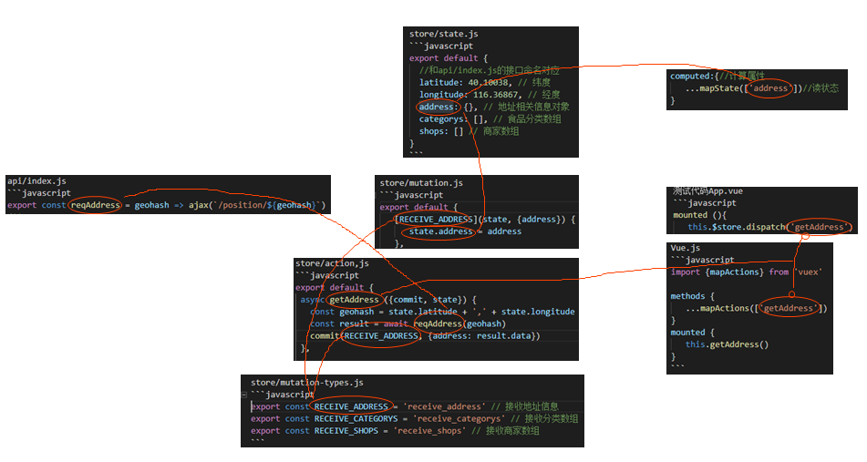

# 外卖vue前端项目

## 02 项目开发准备
[link](https://www.bilibili.com/video/av27148092)  
[zxfjd3g/180920_gshop-client](https://github.com/zxfjd3g/180920_gshop-client)  
[W-Qing/Vue-MintShop](https://github.com/W-Qing/Vue-MintShop)  

[vue项目-硅谷外卖 pan.baidu](链接: https://pan.baidu.com/s/1jR5FeeIcFkLygxtGorz8Uw)  
提取码: s6d3

1. 基于 Vue 的最新版本；
2. 项目是关于外卖业务的前后台分离Web App，功能模块包含商家, 商品, 购物车, 用户管理等多个模块； 
3. 后台应用技术架构为: Node + Express + Mongodb + Mongoose；
4. 前台应用技术架构为: vue + vuex + vue-router + webpack + ES6；
5. 采用模块化、组件化、工程化的模式开发；

项目文件结构  
client_blank//脚手架文件  
client_final//客户端最终版本  
client_pages//静态页面  
server_final//服务端  

### 技术选型

- 前台数据交互处理组件化
	- vue  // //Vue技术栈
	- vue-router //单页路由
	- vuex //管理状态
	- mint-ui //ui组件库
	- vue-lazyload //懒加载
	- vue-croller //滑动库
	- better-scroll
	- swiper
	- moment //这个小一点//日期处理
	- date-fns
- 前后台交互
	- mock数据:mockjs
	- 接口测试：postman
	- ajax请求：vue-resource axios
- 模块化
	- ES6
	- bable
- 项目结构化/工程化
	- webpack
	- vuecli
	- eslint //检测语法规范
- css预编译
	- stylus

### 前端路由
- 一级路由
	- --底部导航--
	- 首页
		 - /msite
		 - Msite.vue
	- 搜索
		 - /seach
		 - Seach.vue
	- 订单
		 - /order
		 - Order.vue
	- 个人
		 - /profile
		 - Profile.vue
	- --不显示导航--
	- 登陆
		- /login
		- Login.vue
	- 商家
		- /shop
		- Shop.vue
- 二级路由（商家）
	- 商品
		- /goods
		- ShopGoods.vue
	- 评价
		- /ratings
		- ShopRatings.vue
	- 信息
		- /info
		- ShopInfo.vue

嵌套才作为子路由

### API
前后台交互API
- API(url 方式 数据格式 / 响应格式)
- 接口文档
- 核对接口
- 联调
- 前后台分离
- mock数据//模拟数据

### 项目vue组件


## 03 创建项目运行

```
gshop
	|-- build: webpack配置文件
	|-- config: webpack配置文件
		|-- index.js: 后台端口 静态资源 打开浏览器
	|-- node_modumes 依赖
	|-- sec: 源码
		|-- main.js: 应用入口
	|-- static: 静态资源文件 如全局样式
	|-- .babelrc: babel配置
	|-- .editorconfig: 编辑器编码/格式配置
	|-- .eslintignore: eslint检查忽略
	|-- .eslintrc: eslint检查
	|-- .gitignore: git忽略配置
	|-- index.html: 主页面
	|-- package.json: 应用包配置信息 版本号 依赖 命令
	|-- README.md: 说明文件
```


开发环境运行  
vue init webpack folder //创建项目  
cd colder  
npm install //安装依赖  
npm run dev // mpn start //运行  

生产环境打包运行  
npm run build // 打包项目  
npm install -g serve //安装打包项目  
serve dist //运行  

config/index.js:autoOpenBrowser//自动打开浏览器

## 04 资源准备
1. 标注图(设计稿)：标注界面元素的坐标 大小 元素
2. 切图：PS切图拿素材
3. 图片base64编码：小图片转为字符编码 减少请求次数（打包工具会做）
4. 2x图3x图：适配屏幕尺寸

**iconfont**图标字体
[iconfont](www.iconfont.cn)  
矢量图 改变图标颜色大小不需要PS
```html
<link rel="stylesheet" href=""></link><!--引入-->
```
添加后需要更新url

## 05 项目目录结构
WebStorm

src
	|-- api         //后台交互模块(ajax函数/接口函数)  
	|-- common      //共用资源(or assets fonts/images/stylus)  
	|-- components  //非路由组件  
	|-- filters      //自定义过滤器模块  
	|-- mock        //模拟数据接口  
	|-- pages       //路由组件  
	|-- router      //路由器  
	|-- store       //Vuex相关模块  
	|-- App.vue     //应用根组件  
	|-- main.js     //js入口文件  

## 06 stylus

1. 安装依赖包  
*npm install stylus stylus-loader --save-dev*  
stylus: stylus转译为css包  
stylus-loader: webpack的stylus构建工具

2. 编写样式  
&ltstyle lang="stylus" rel="stylesheet/stylus">&lt/style>  
stylus语法声明

> stylus说明：  
	1. [stylus-en](http://stylus-lang.com/) [stylus-zh](https://stylus.bootcss.com/)  
	2. 代码由缩进控制，用table不要用空格，省略{ ; 可选 :  
	3. 父级引用 &  
	4. 变量 $  
	5. 混合  
	6. 导入  

> [stylus预处理入门(一)](https://www.jianshu.com/p/5838497ec56e)

common/stylus/mixins.styl
```stylus
$green = #02a774;
$yellow = #F5A100;
$bc = #e4e4e4;

// 一像素下边框
bottom-border-1px($color)
  position relative
  border none
  &:after
    content ''
    position absolute
    left 0
    bottom 0
    width 100%
    height 1px
    background-color $color
    transform scaleY(0.5)

// 一像素上边框
top-border-1px($color)
  position relative
  &::before
    content ''
    position absolute
    z-index 200
    left 0
    top 0
    width 100%
    height 1px
    background-color $color

//根据像素比缩放1px像素边框
@media only screen and (-webkit-device-pixel-ratio: 2 )
  .border-1px
    &::before
      transform scaleY(.5)

@media only screen and (-webkit-device-pixel-ratio: 3 )
  .border-1px
    &::before
      transform scaleY(.333333)

//根据像素比来使用 2x图 3x图
bg-image($url)
  background-image: url($url + "@2x.png")
  @media (-webkit-min-device-pixel-ratio: 3),(min-device-pixel-ratio: 3)
    background-image: url($url + "@3x.png")

//清除浮动
clearFix()
  *zoom 1
  &::after
    content ''
    display block
    clear both
	 
```

## 07 组件化编码

### 添加模板
file->setings...->editer->file and code tamplates->files->vue

```html
<template>
	<div>
		
	</div>
</template>

<script>
	export default {}
</script>

<style lang="stylus" rel="stylesheet/stylus">
	
</style>
```

### vue组件结构

```
src
|-- components------------	非路由组件文件夹
	|-- FooterGuide---------底部组件文件夹
		|-- FooterGuide.vue--底部组件 vue
|-- pages------------------路由组件文件夹
	|-- Msite---------------首页组件文件夹(home)
		|-- Msite.vue--------首页组件 vue
	|-- Search--------------搜索组件文件夹
		|-- Search.vue-------搜索组件 vue
	|-- Order---------------订单组件文件夹
		|-- Order.vue--------订单组件 vue
	|-- Profile-------------个人组件文件夹(personal)
		|-- Profile.vue------个人组件 vue
|-- App.vue----------------应用根组件 vue
|-- main.js----------------应用入口 js
```

组件目录 vue组件文件 组件内名字(template->div)


```javascript
//main.js
import Vue from 'vue'
import App from './App.vue'

new Vue({
	el: '#app'
	render: h => h(App)
})
```

### 引入reset样式

1. static/css/reset.css
```css
/* http://meyerweb.com/eric/tools/css/reset/ 
   v2.0 | 20110126
   License: none (public domain)
*/

html, body, div, span, applet, object, iframe,
h1, h2, h3, h4, h5, h6, p, blockquote, pre,
a, abbr, acronym, address, big, cite, code,
del, dfn, em, img, ins, kbd, q, s, samp,
small, strike, strong, sub, sup, tt, var,
b, u, i, center,
dl, dt, dd, ol, ul, li,
fieldset, form, label, legend,
table, caption, tbody, tfoot, thead, tr, th, td,
article, aside, canvas, details, embed, 
figure, figcaption, footer, header, hgroup, 
menu, nav, output, ruby, section, summary,
time, mark, audio, video {
	margin: 0;
	padding: 0;
	border: 0;
	font-size: 100%;
	font: inherit;
	vertical-align: baseline;
}
/* HTML5 display-role reset for older browsers */
article, aside, details, figcaption, figure, 
footer, header, hgroup, menu, nav, section {
	display: block;
}
body {
	line-height: 1;
}
ol, ul {
	list-style: none;
}
blockquote, q {
	quotes: none;
}
blockquote:before, blockquote:after,
q:before, q:after {
	content: '';
	content: none;
}
table {
	border-collapse: collapse;
	border-spacing: 0;
}
```

index.html中引入
```html
<!--index.html-->

<title>...</title>
<!-- + -->
<link rel='stylesheet' href='/static/css/reset.css'>
<link rel='stylesheet' ... >
```

### 移动端

1. viewport

2. 点击0.3s问题

```html
<!--index.html-->
<head>

<meta charset="utf-8">

<!-- <meta name="viewport" content="width=device-width, initial-scale=1.0"> -->
<!-- + -->
<meta name="viewport"
   content="width=device-width,initial-scale=1.0,maximum-scale=1.0,minimum-scale=1.0,user-scalable=no">

.<title>gshop</title>

<link rel="stylesheet" href="/static/css/reset.css">

<link rel="stylesheet" href="http://at. alicdn.com/t/font_518606_6676bmcalnrhehfr. css">

<!-- + -->
<script src="https://as.alipayobjects.com/g/component/fastclick/1.0.6/fastclick.js"></script>

<!-- + -->
<script>
if ( ' addEventListener' in document) {
	document.addEventListener( 'DOMContentLoaded' , function() {
		FastClick.attach( document.body ) ;
}, false);
if( !window.Promise) {
document.writeln('<script src="https://as.alipayobjects.com/g/component/es6-promise/3.2.2/es6-promise.min.js')//这个链接不确定
}
</head>
```

## 08 引入vue-router

1. 下载vue-router

```
npm install vue-router --save
```

2. 编码
	- router/index.js
	- 入口文件main.js
	- App.vue里使用router-view

**router/index.js**
```javascript
 /*
   路由模块 
 */
 import Vue from 'vue'
 import VueRouter from 'vue-router'
 // 引入路由组件文件夹下的组件
 import Msite from '../pages/Msite/Msite.vue'
 import Search from '../pages/Search/Search.vue'
 import Order from '../pages/Order/Order.vue'
 import Profile from '../pages/Profile/Profile.vue'
 // 全局注册Vue-router组件
 Vue.use(VueRouter)
 
 // 配置路由表并导出
 export default new VueRouter({
   //去掉地址中的哈希#
   mode: 'history',
   routes: [{
       path: '/', //默认页面
       redirect: '/msite'
     },
     {
       path: '/msite',
       component: Msite,
     },
     {
       path: '/search',
       component: Search,
     },
     {
       path: '/order',
       component: Order,
     },
     {
       path: '/profile',
       component: Profile,
     }
   ]
 })
```

**编写应用的入口文件main.js**
```javascript
//main.js
import Vue from 'vue'
import App from './App.vue'
//+
import touter from './router'

new Vue({
	el: '#app'
	render: h => h(app)，
	//+
	router//增加rout的3个组件和2个属性
})
```

**在App.vue里使用router-view**
```html
<!-- App.vue -->

<template>
  <!-- 修改应用组件的模板 -->
  <div id="app">
    <!-- 设置路由组件的视图位置 -->
    <router-view></router-view>
    <!-- 并放置非路由组件 -->
	<FooterGuide></FooterGuide>
	
	<!-- 或者作用闭合标签<FooterGuide/> -->
  </div>
</template>

<script>
import FooterGuide from './components/FooterGuide/FooterGuide.vue'
// 引入底部组件并注册
export default {
  components: {
    FooterGuide
  }
}
</script>

<style lang="stylus" rel="stylesheet/stylus">
// 整个应用组件的样式
  #app
    width 100%
    height 100%
    background #f5f5f5
</style>
```

## 09 FooterGuide组件

1. 实现导航组件页面切换
2. 用动态class和$route.path实现tab样式切换
3. 用阿里图标库显示导航图标

### 抽取静态页面

抽取静态页面的样式和HTML到vue文件中

**根组件**
抽取样式 stylus/index.styl -> #app  
与 App.vue &lttemplate> 的 div id 对应  
在 &ltstyle> 里添加 .app 和抽取的样式

**FooterGuide**
抽取index.html -> &ltfooter_guide>  
到 FooterGuide.vue &lttemplate> 中  
抽取样式 stylus/index.styl -> .footer_guide  
到 FooterGuide.vue &lt&ltstyle> 中  
添加 common/styles/index.styl 文件引用引入变量

```html
<!-- template的图标强制绑定动态class
 -->
<!-- 对象语法 -->
<div class="guide_item" :class="{on: isCurrent('/msite')}">
<div class="guide_item" :class="{on: '/msite'===$route.path}">

<!--
	:class=
	{} 对象
	on:类名
	后边更布尔值

	已知class名称 决定是否添加
-->


<!-- 绑定onClick事件 -->
<div class="guide_item" :class="{on: isCurrent('/msite')} " @click="goto('/msite')">

<script>
ecport default {
	methods: {
		goTo(path) {
			this.$router.replace(path)
		}
	}
}
</script>
```

## 10 各导航路由组件(静态)
### Msite组件
Msite下新建images文件夹
考入图片资源/nav(分类导航) /shop(商家) /stars(星星)

复制代码 样式(对应class 引入index.styl

### Search组件
Slot语法抽取样式

## 11 HeaderTop组件
头部区分不同页面用Slot
头部这样标题的文字用Pnops
文件结构同FooterGuide

HeaderTop.vue
```html
<template>
  <header class="header">
    <!-- 插槽是父组件与子组件的通讯方式，子组件中的slot可以显示父组件传递给子组件的内容 -->
    <slot name="left"></slot> <!-- 插槽 -->
    <span class="header_title">
	 	<!-- 内容接收一个属性 -->
      <span class="header_title_text ellipsis">{{title}}</span>
    </span>
    <slot name="right"></slot> <!-- 插槽 -->
  </header>
</template>
<script>
  export default {
    // 外部组件传递给此组件的属性
    props: {
      title: String
    }
  }
</script>
```

在Msite等组件内引入HeaderTop
```html
<!-- 使用 title 来给头部组件传递数据 -->
<HeaderTop title="芝罘区鲁东大学北区(青年南路)">
  <!-- 要使用slot="left"指定插入的插槽位置 -->
  <span class="header_search" slot="left">
  <!-- 使用插槽 -->
    <i class="iconfont icon-sousuo"></i>
  </span>
  <span class="header_login" slot="right">
  <!-- 使用插槽 -->
    <span class="header_login_text">
          登录|注册
    </span>
  </span>
</HeaderTop>

<script>
//Msite、Order、Search、Profile中都要引入注册才能使用
import HeaderTop from '../../components/HeaderTop/HeaderTop.vue'
export default {
  components: {
    HeaderTop
  }
}
</script>
```

---
### props
效果类似函数参数  

组件:comp.vue
```html
<template>
	<span class="header_title_text ellipsis">{{para}}</span><!-- 使用props参数 -->
<template>

<script>
//Msite、Order、Search、Profile中都要引入注册才能使用
import HeaderTop from '../../components/HeaderTop/HeaderTop.vue'
  export default {
    props: {//相当于定义参数
      para: String
    }
  }
</script>
```

引用:
```html
<template>
	<!-- 组件映射为标签 参数映射为属性 -->
	<comp para=“xxxxxx” />
</template>
<script>
//引入插件
import conp from './conp.vue'
export default {
  components: {
    conp//注册插件 能够作为标签引用
  }
}
</script>
```

### slot
类似引用父对象声明的父级变量

组件：
```html
<template>
	<!-- slot对应父级的属性 name对应slot属性的值 -->
	<slot name="left"></slot> <!-- 插槽 -->
</template>
```

引用：
```html
<template>
  <!-- solt 对应组件的slot标签 "right"对应name属性 -->
  <!-- 组件里的插槽占位 标签和内容都会被父级替换掉 -->
  <conp>
	<span slot="right">
		<span>
				登录|注册
		</span>
	</span>
  </conp>
</template>

<script>
//引入插件
import conp from './conp.vue'
export default {
  components: {
    conp//注册插件 能够作为标签引用
  }
}
</script>
```

引用时
1. import插件 components作为标签(dom元素)
2. 在template里用 comp标签 用组件的template替换
3. 标签属性对应props
4. 标签内容添加slot属性 对应slot 替换掉组件内的slot

组件内
1. 用props定义传递数据name 类型
2. 在template里使用 {{name}} 引用数据
3. 用slot标签占位 name属性标记

组件component作为最终实现效果给父级引用
父级用props给组件传递数据
父级用slot给组件传递DOM

# 12 swiper商品分类列表轮播
[swiper-en](https://idangero.us/swiper/)  
[swiper-ch](https://www.swiper.com.cn)

```
npm install --save swiper
```

```html
<template>
<!--在页面msite_nav导航部分使用swiper-->
<div class="swiper-container">
	<div class="swiper-wrapper">
        <div class="swiper-slide">1</div>
        <div class="swiper-slide">2</div>
        <div class="swiper-slide">3</div>
    </div>
    <!-- swiper轮播图圆点 -->
    <div class="swiper-pagination"></div>
</div>
</template>

<script>
import Swiper from 'swiper'
//同时引入swiper的 css文件
import 'swiper/dist/css/swiper.min.css'
export default {
  //注意要在页面加载完成之后（mounted）再进行swiper的初始化
  mounted () {
    //创建一个swiper实例来实现轮播
    new Swiper('.swiper-container', {
      autoplay: true,//自动播放
		loop: true,//循环
      // 如果需要分页器
      pagination: {
        el: '.swiper-pagination',
        clickable: true
      }
   })
  }
}
</script>
```

## 13 ShopList组件
抽取Msite商家列表组件
一般组件 在components下创建

```
components
	|-ShopList
		|-images
			|-shop //之后会从后台获取
			|-stars
		|-ShopList.vue
```
同样抽取HTML 样式 引入样式文件  
在Msit中使用

## 14 Loging组件
路由组件 pages下创建  
router/index.js下添加  
prefile添加路由效果 页面样式浮动 
```html
<router-link to='/login' class='styl....'>
	....
</router-link>
<style>

.profile
	overflow hidden
</style>
```
因为路由是在页面内部替换内容所以页面滚动位置是共享的

回退按钮：  
回退图标添加 
```html
<a @click="$router.back()">
```

去掉登录页面的Footerguide组件：
App.vue里修改
```html
<template>
  <!-- 修改应用组件的模板 -->
  <div id="app">
    <router-view/>
	<FooterGuide v-show="$route.mate.showFooter"/>
	<!-- 或者v-if -->
	
	<!-- 或者作用闭合标签<FooterGuide/> -->
  </div>
</template>
```

router/index.js:
```javascript
{
  path: '/msite',
  component: Msite,
  meta: {//添加路由传递参数
    showFooter: true
  }
},
```

## 15 启动后台应用并测试接口
运用技术
- Express
- mongoDB
- mongoose

提供文档：
- api文档
- postman测试结果记录

电脑开启mongoDB服务
```
npm start //运行
```
bin/www //配置信息 

api文档：
1. 根据经纬度获取位置详情
2. 获取食品分类列表
3. 根据经纬度获取商铺列表
4. 根据经纬度和关键字搜索商铺列表
5. 获取一次性验证码
6. 用户名密码登陆
7. 发送短信验证码
8. 手机号验证码登陆
9. 根据会话获取用户信息
10. 用户登出

```
	请求:
	http://localhost:3000/position/40.10038,116.36867

	{
      "code": 0,//数据正常
      "data": {
        "address": "北京市昌平区337省道",
        "city": "北京市",
        "geohash": "40.10038,116.36867",
        "latitude": "40.10038",
        "longitude": "116.36867",
        "name": "昌平区北七家宏福科技园(337省道北)"
      }
    }
```
用postman测试 

调试后端
gshop-server_final/routesindex.js

## 16 封装接口请求函数

api文件夹下创建ajax.js index.js
npm install --save ajax 

```javascript
/*
ajax 请求函数模块
*/ 
import axios from 'axios'
/**
 * 向外部暴漏一个函数 ajax
 * @param {*} url 请求路径，默认为空
 * @param {*} data 请求参数，默认为空对象
 * @param {*} type 请求方法，默认为GET
 */
export default function ajax(url = '', data = {}, type = 'GET') {
  // 返回值 Promise对象 （异步返回的数据是response.data，而不是response）
  return new Promise(function (resolve, reject) {
    //（利用axios）异步执行ajax请求
    let promise // 这个内部的promise用来保存axios的返回值(promise对象)
    if (type === 'GET') {
      // 准备 url query 参数数据
      let dataStr = '' // 数据拼接字符串，将data连接到url
      Object.keys(data).forEach(key => {
        dataStr += key + '=' + data[key] + '&'
      })
      if (dataStr !== '') {
        dataStr = dataStr.substring(0, dataStr.lastIndexOf('&'))
        url = url + '?' + dataStr
      }
      // 发送 get 请求
      promise = axios.get(url)
    } else {
      // 发送 post 请求
      promise = axios.post(url, data)
    }
    promise.then(response => {
        // 成功回调resolve()
        resolve(response.data)
      })
      .catch(error => {
        // 失败回调reject()
        reject(error)
      })
  })
}
```

## 17 封装接口请求函数

api/index.js
```javascript
export const reqAddress = geohash => ajax(`/position/${geohash}`)
/**
 * 获取 msite 页面食品分类列表
 */
export const reqCategorys = () => ajax('/index_category')
/**
 * 获取 msite 商铺列表(根据query参数：经纬度)
 * 将经纬度两个数据作为一个参数对象传入
 * 也可以两个数据分别传入ajax， 然后再放入一个对象参数内， 如下面的手机号验证码接口
 */
export const reqShops = ({
  latitude,
  longitude
}) => ajax('/shops', {
  latitude,
  longitude
})
/**
 * 账号密码登录
 */
export const reqPwdLogin = (name, pwd, captcha) => ajax('/login_pwd', {
  name,
  pwd,
  captcha
}, 'POST')
/**
 * 获取短信验证码
 */
export const reqSendCode = phone => ajax('/sendcode', {
  phone
})
/**
 * 手机号验证码登录
 */
export const reqSmsLogin = (phone, code) => ajax('/login_sms', {
  phone,
  code
}, 'POST')
/**
 * 获取用户信息(根据会话)
 */
export const reqUser = () => ajax('/userinfo')
/*
 * 请求登出
 */
export const reqLogout = () => ajax('/logout')
```

他这里说的params参数和query参数是啥意思  
[vue嵌套路由-params和query传递参数](https://www.jianshu.com/p/ef6d62a60ce6)  
虽然没啥关系

// todo 快速赋值相关内容
```javascript
export const reqShops = ({latitude,longitude}) => ajax('/shops', {latitude,longitude})
export const reqShops = ({a,b}) => ajax('/shops', {latitude:a,longitude:b})
export const reqShops = (latitude,longitude) => ajax('/shops', {latitude,longitude})
```

## 18 git版本控制
应包含
.gitignore:
```
.DS_Store
node_modules/ #node模块
/dist/
npm-debug.log*
yarn-debug.log*
yarn-error.log*

# Editor directories and files
.idea #脚手架生成 react脚手架不会生成这个
.vscode
*.suo
*.ntvs*
*.njsproj
*.sln
```

生成本地仓库
git init
git add *
git commit -m "init gshop"

创建远程仓库
... 171208_gshop
关联仓库
git remote add origin https://github.com/....
推送
git push origin master

## 19 复习

1. 项目描述：此项目为一个前后端分离的外卖 Web App (SPA) 项目
2. 技术选型：使用了 Vue 全家桶+ES6+Webpack 等前端最新技术
3. api接口：包括商家, 商品, 购物车, 用户等多个功能子模块
采用模块化、组件化、工程化的模式开发

所有组件都能使用route  
$router 路由器对象，操作路由实现导航，router-view route-link keep-alive  
$route 当前路由对象，path/mate/query/patams


## 20 配置代理实现跨域ajax请求
测试[## 17 封装接口请求函数](#17_封装接口请求函数)

在App.vue中测试
```javascript
export default{
	async mounted() {
		const result = await reqFoodTypes()
		console.log(result)
	},
}
```

config/index.js
```javascript
// Paths
assetsSubDirectory: ' static',
assetsPublicPath: '/',
proxyTable: {
	'/api' : { // 匹配所有以 '/api' 开头的请求路径
	target: 'http://localhost: 4000', // 代理目标的基础地址
	changeOrigin: true, // 支持跨域
		pathRewrite: {// 重写路径 会去掉开头的'/api'
			'^/api' : ''
		}
	}
},
```

17 封装接口请求函数添加基础路径
```javascript
const BASE_URL='/api'
//为请求添加BASE_URL
```

## 21 创建vuex整体结构
[xuex-ch](https://vuex.vuejs.org)  
[vuex-zh](https://vuex.vuejs.org/zh/guide/)  
异步显示  
npm install --save vuex

store/index.js //vuex管理对象  
store/state.js //状态对象  
store/mutations.js //操作state对象  
store/mutation-types.js //mutation和名称常量 用于和action间交互  
store/actions.js //从api获取数据 操作mutation对象  
store/getters.js //基于state的计算属性  


store/index.js
```javascript

/*
vuex最核心的管理对象store
 */
// 首先引入Vue及Vuex
import Vue from 'vue'
import Vuex from 'vuex'

// 引入四个基本模块
import state from './state'
import mutations from './mutations'
import actions from './actions'
import getters from './getters'

// 一定要声明使用插件
Vue.use(Vuex)

// 把 store 对象提供给 “store” 选项，这可以把 store 的实例注入所有的子组件
export default new Vuex.Store({
  state,
  mutations,
  actions,
  getters
})
```

## 22 vuex管理页面状态
store/state.js
```javascript
export default {
  //和api/index.js的接口命名对应
  latitude: 40.10038, // 纬度
  longitude: 116.36867, // 经度
  address: {}, // 地址相关信息对象
  categorys: [], // 食品分类数组
  shops: [] // 商家数组
}
```

store/mutation-types.js
```javascript
/*
包含n个mutation的type名称常量
 */
export const RECEIVE_ADDRESS = 'receive_address' // 接收地址信息
export const RECEIVE_CATEGORYS = 'receive_categorys' // 接收分类数组
export const RECEIVE_SHOPS = 'receive_shops' // 接收商家数组
```

store/mutation.js
```javascript
/*
vuex 的 mutations 模块
*/
//引入mutation type
import {RECEIVE_ADDRESS,RECEIVE_CATEGORYS,RECEIVE_SHOPS} from './mutation-types'

// [方法名](state,{param}){}
export default {
	[RECEIVE_ADDRESS](state, {address}) {
		state.address = address
	},
	[RECEIVE_CATEGORYS](state, {categorys}) {
		state.categorys = categorys
	},
	[RECEIVE_SHOPS](state, {shops}) {
		state.shops = shops
	}
}
```

store/action,js
```javascript
// Action:通过操作mutation间接更新state的多个方法的对象
// 注意要引入api接口函数
import {reqAddress, reqCategorys, reqShops} from '../api'
import {RECEIVE_ADDRESS, RECEIVE_CATEGORYS, RECEIVE_SHOPS} from './mutation-types'
export default {
 // 异步获取地址
 async getAddress ({commit, state}) {
   // 从state状态中获取到经纬度用来设置reqAddress的参数（看接口文档）
   const geohash = state.latitude + ',' + state.longitude
   
   // 1. 发送异步ajax请求
	//这里可以用promise.then或者asyne/await
   const result = await reqAddress(geohash)
   // 2. 根据结果提交一个mutation
	// if(result.code==1)
   commit(RECEIVE_ADDRESS, {address: result.data})
 },

 // 异步获取分类列表
 async getCategorys ({commit}) {
   const result = await reqCategorys()
   commit(RECEIVE_CATEGORYS, {categorys: result.data})
 },

 // 异步获取商家列表
 async getShops ({commit, state}) {
   // 对象的解构赋值
   const {latitude, longitude} = state
   // 注意参数的顺序
   const result = await reqShops({latitude, longitude})
   commit(RECEIVE_SHOPS, {shops: result.data})
 }
}
```

在项目中注册store
```javascript
//main.js
import Vue from 'vue'
import App from './App.vue'
//+
import touter from './router'
import store from './store'

new Vue({
	el: '#app'
	render: h => h(app)，
	//+
	router,//增加rout的3个组件和2个属性
	store
})
```

测试代码App.vue
```javascript
mounted (){
	this.$store.dispatch('getAddress')
	//这里不需要填参数？
	//只是做触发，所有状态都在state里,接收填充数据同时也作为请求参数
}
```
看开发工具里是否发起请求 vue BaseState里获取到数据

## 23 异步显示当前地址

使用映射函数触发dispatch
Vue.js
```javascript
import {mapActions} from 'vuex'

methods {
	...mapActions(['getAddress'])
}
mounted {
	this.getAddress()
}
```

MSite.vue
```html
<template>
<HeaderTop :title='address.name'/><!-- :强制绑定 显示 -->
<!-- 加冒号就是后面将解释为对象 -->
</template>
<script>
import {mapState} from 'vuex'
export default {
	props:{
		title: String
	},
	computed:{//计算属性
		...mapState(['address'])//读状态
	}
}
</script>
```



## 24 异步显示食品分类轮播列表
MSite.vue添加代码
```html
<template>
	<!--通过v-for循环渲染data的信息 注意src为绑定数据--> 
	<div class="swiper-slide" v-for="(pages,index) in categorysArr" :key="index">
		<a href="javascript:" class="link_to_food" v-for="(data,index) in pages" :key="index">
			<div class="food_container">
				
			</div>
			<span>{{data.title}}</span>
		</a>
	</div>
</template>
<script>
import {mapState} from 'vuex'
export default {
	props:{
		title: String
	},
	data (){
		return {
			baseImageUrl:'https://ccc.com/x'
		}
	}
	mounted(){
    	this.$store.dispatch('getCategorys')
    	//...	
	},
	computed:{//计算属性
		...mapState(['address,categorys'])//读状态
		//转为二维数组
		categorysArr(){
			const {categorys}=this
			const arr = []
			let minArr=[]
			categorys.forFach(c=>{
				if(minArr.length===8){
					minArr=[]
				}
				if(minArr===0){
					arr.push(minArr)
				}
				minArr.push(c)
			})

		}
	}
}
</script>
```

## 25 使用watch和nextTick解决轮播的bug
使用watch和$nextTick解决轮播的bug

用Swiper监视categorys数变化  
用vm.$nextTick( [callback] )来实现等待界面完成异步更新就立即创建Swiper对象

MSite.vue添加代码替换之前的Swiper代码
```javascript
export default {
	watch: {
		categorys (value) { // categorys数组中有数据了
			// 但界面还没有异步更新
			this.$nextTick(() => {
				// 一旦完成界面更新, 立即执行回调
				new Swiper('.swiper-container', {
					autoplay: true,
					pagination: {
						el: '.swiper-pagination',
						clickable: true
					}
				})
			}
		}
	}
}
```