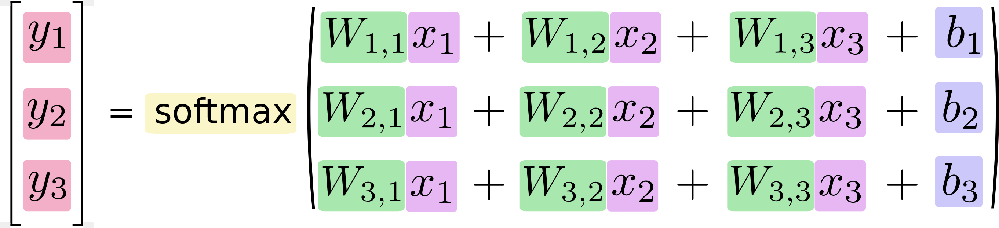

## TF初探
[tensorflow-zh](https://github.com/jikexueyuanwiki/tensorflow-zh/blob/master/TOC.md)

[tensorflow-google](https://tensorflow.google.cn/tutorials)

[log-2019-01-11](../../日志/log-2019-01-11.md)  
第一节以及基础概念  
MNIST入门  
回归模型  
概率论和统计  
归一化  

[log-2019-01-13](../../日志/log-2019-01-13.md)  
似然函数

### MNIST入门
[link](http://wiki.jikexueyuan.com/project/tensorflow-zh/tutorials/mnist_beginners.html)


#### MNIST数据集
MNIST入门级的计算机视觉数据集（手写数字）  

图片-标签  
Softmax Regression 逻辑回归  
60000行的训练数据集（mnist.train）和10000行的测试数据集（mnist.test）  
区分训练集的独立的数据集利于泛化推广到其他数据  

图片数据格式\(\)\[28*28\] /784  
标签数据格式mnist.train.labels \[0,0,0,1...\] 0到1的10维单点向量"one-hot   vectors"  

#### Softmax回归介绍
获得输出的个单点向量的概率  
先对图片加权求和获得图片是某个数字的证据（evidence）  

- 属于 权值+ 红色
- 不属于 权值- 蓝色


- i 图片索引
- j 像素索引
- Wi 权重
- bi bi权重

---

概率y:


softmax可以看成是一个激励（activation）函数或者链接（link）函数

  
使用的值

  
正则化

Softmax 可以参考Michael Nieslen的书里面的[这个部分](http://neuralnetworksanddeeplearning.com/chap3.html#softmax)

图示  
  
  
  

最后  
  

#### 实现回归模型
代码实现

Tensorflow先描述可交互的计算机操作，然后放在puthon之外一起运行

```python
import tensorflow as tf
x = tf.placeholder(tf.float32, [None, 784])
#用操作符号变量描述可交互的操作单元
#是一个N张图片 图片内784个像素

W = tf.Variable(tf.zeros([784,10]))#[784,10] 每个结果对应的各个像素点的权重
b = tf.Variable(tf.zeros([10]))#[10] 每个结果附加的偏差
#Variable模型参数标识张量 可数据输入和修改

y = tf.nn.softmax(tf.matmul(x,W) + b)
#j矩阵运算后输入到softmax回归函数里 建立计算模型
```

#### 训练模型
用成本(cost)和损失(loss)表示模型的好坏  
交叉熵作为成本函数  
  

y 是我们预测的概率分布, y' 是实际的分布（我们输入的one-hot vector)。比较粗糙的理解是，交叉熵是用来衡量我们的预测用于描述真相的低效性。[参考](http://colah.github.io/posts/2015-09-Visual-Information/)

```python
#模型训练部分

y_ = tf.placeholder("float", [None,10])
#结果数据
cross_entropy = -tf.reduce_sum(y_*tf.log(y))
#计算交叉熵
train_step = tf.train.GradientDescentOptimizer(0.01).minimize(cross_entropy)
#用反向传播算法(backpropagation algorithm)来计算权重是如何影响成本值的
#从而调整权重获得最小化的成本
#整理使用梯度下降法 会添加一系列计算操作单元以执行计算

init = tf.initialize_all_variables()
#初始化创建的变量
sess = tf.Session()
sess.run(init)
#在sysion中启动模型
for i in range(1000):
	batch_xs,batch_ys=mnist.train.next_batch
	sess.run(train_step,feed_dict=(x:batch_xs,y_:batch_ys))

```
[性能对比]](http://rodrigob.github.io/are_we_there_yet/build/classification_datasets_results.html)