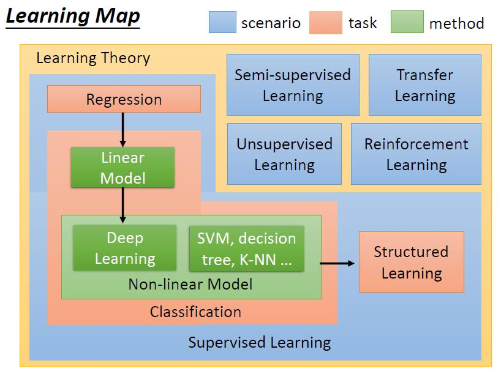

# note-2019-10-17-Machine Learning (Hung-yi Lee NTU)

youtobe: https://www.youtube.com/watch?v=CXgbekl66jc&list=PLJV_el3uVTsPy9oCRY30oBPNLCo89yu49  
課程網頁: http://speech.ee.ntu.edu.tw/~tlkagk/courses_ML17_2.html  
https://pan.baidu.com/s/1Shjn2el7gr3RPNlUTnBtxw  
bili: https://www.bilibili.com/video/av65521101/?p=1  

## 0-1 Introduction of Machine Learning
ML Lecture 0-1: Introduction of Machine Learning

人工智能AI -> 机器学习ML -> 深度学习DL

Training：

Model  
衡量结果 -> 演化演算 -> 训练后的模型 测试使用
训练数据  

** learning scenario **

- Supervised Learning 有监督学习  
  需要大量train data - input/output pair of target function
  .
  - Regression回归 一种ML的task 输出是scalar/real number的function
  - Classification分类器 
    - Binary Classification 二元分类器
    - multi-classification
    - /
    - Linear Model
    - Non-linear Model
      - Deep Learning (Hierarchical Structure)
      - SVM,decision tree,K-NN
  - Structured Learning (输出结构化的数据 语音识别 翻译 人脸)
    - GAN 对抗网络
- Semi-supervised Learning 半监督学习  
  labelled data and unlabeled data
- Tranfer Learning 迁移学习
  - other labelled data,other unlabeled data,
- Unsupervised Learning 无监督学习
- Reinforcemont Learning 增强学习 (game AlphaGo)  
  只有最终结果的情况下对之间过程学习分析
  learning from critics

- scenario 情景 方案
  - task
    - method (model)