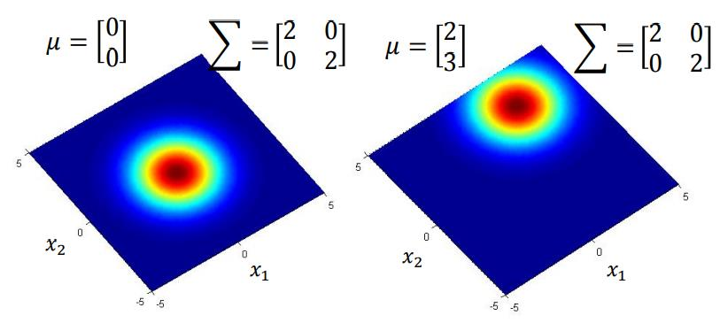
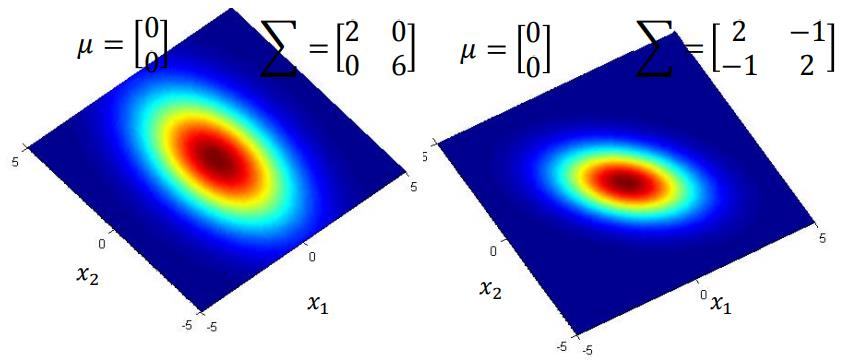
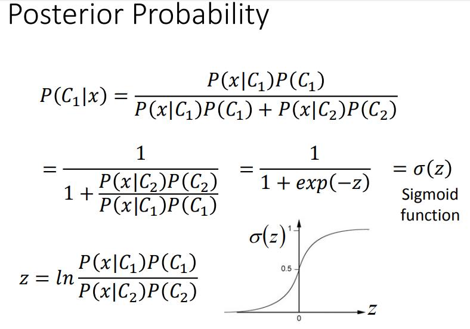

## 4 Classification
[ML Lecture 4: Classification](https://www.youtube.com/watch?v=fZAZUYEeIMg&list=PLJV_el3uVTsPy9oCRY30oBPNLCo89yu49&index=9)  
[pdf](http://speech.ee.ntu.edu.tw/~tlkagk/courses/ML_2016/Lecture/Classification%20(v3).pdf)

对于分类问题使用Regression方法会存在的问题
1. 每个分类即一个维度的输出，映射为-1 或者1
    - 把大的特征值映射到1(空间距离远里边界的样本计算结果也要是1)，参数就会相对的抑制特征
    - Regression会倾向于用权重去划分边界，Classification更关注区分两者，不会引入权重上的干扰
2. 把分类映射到一个维度的不同数值上
    - 不同分类间产生距离关系

替代思路
- Function (model): 0&space;\qquad&space;&&space;Output&space;&=&space;class&space;1&space;\\&space;else&space;\qquad&space;&&space;&space;Output&space;&=&space;class&space;2\end{matrix}\right." title="\bg_white f(x)=\left\{\begin{matrix} g(x)>0 \qquad & Output &= class 1 \\ else \qquad & Output &= class 2\end{matrix}\right." />
- Loss function:
  &delta;()即Number(boolean)  
- Find the best function:
  - Example:Perceptron,SVM (非线性的方法?)

抽Box 1几率P(B<sub>1</sub>)
  Box 1中蓝球几率P(Blue|B<sub>1</sub>)
抽Box 2几率P(B<sub>2</sub>)
  Box 2中蓝球几率P(Blue|B<sub>2</sub>)

一个蓝球是从Box 1抽出来的几率  


### Genetative Model


P(C<sub>1</sub>)=C1count/Total  
P(C<sub>2</sub>)=C2count/Total  
P(x|C<sub>1</sub>) = 计算出 C1的高斯分布 带入x  
P(x|C<sub>2</sub>) = 计算出 C2的高斯分布 带入x  


从所可能中选择当前Example(x<sup>1</sup>)的几率
1. 认为当前样本集是在高斯分布(Gaussian distribuion)中的一部分
2. 还原Gaussian distribution,计算x<sup>1</sup>在Gaussian distribution中的几率(probability的determine  p正比于d)


**&mu;** is mean  
**&Sigma;** is covariance matrix 

  


**Masimum Likelihood**  
找到最大可能性的Gaussian

Gaussian 的可能性(Likelihood)为:  


Masimum Likelihood的Gaussian为


对于7维的数据x=\[x1...x7\]  
&mu;<sup>1</sup>,&mu;<sup>2</sup>:dim vector  
&Sigma;<sup>1</sup>,&Sigma;<sup>2</sup>：7*7 matrices

### 改进
每个class用不同的Gaussian是比较少见的  
通常不同的Class可以用同一个covariance matrix(\Sigma)  
    - covariance matrix 和 input feature size平方呈正比
    - mldel参数多 容易voerfiting


x<sup>1</sup>-x<sup>n-1</sup>：class 1  
x<sup>n</sup>...:class 2

&mu;<sup>1</sup>,&mu;<sup>2</sup>依然是算平均数

```
Ref:<Bishop>
chapter 4.2.2
```


***使用同一个covariance matrix后模型为linear Model***  
boundary is linear

假设input feature为独立事件 P(x)=P(x<sub>1</sub>)P(x<sub>2</sub>)...  
那么Gaussian为1-D Gaussian  
P(x|C<sub>1</sub>) = P(x<sub>1</sub>|C<sub>1</sub>)P(x<sub>2</sub>|C<sub>1</sub>) ... P(x<sub>k</sub>|C<sub>1</sub>) ...  
考虑使用 Naive Bayse Classifier

如果是Bianry fratures 那么应该使用Bernoulli distribution



\\todo Warning of Math


可以使用Logistic Regression获得参数w和b


