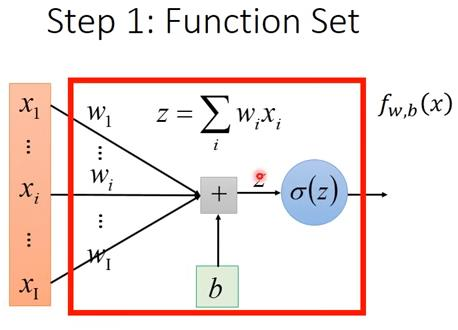
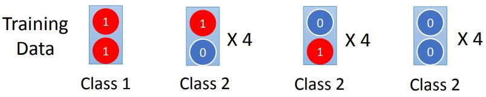
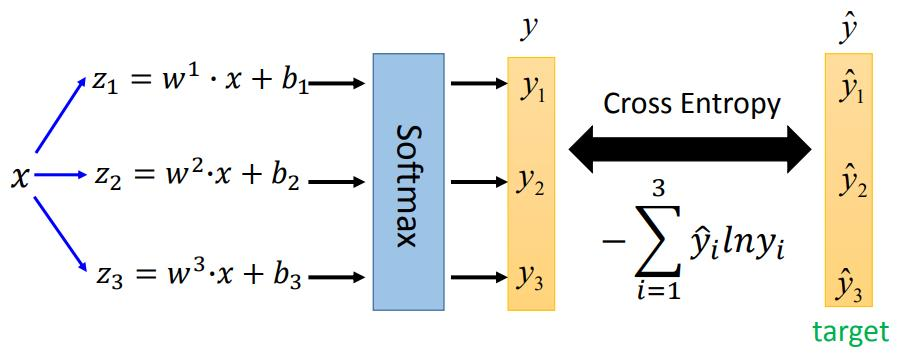
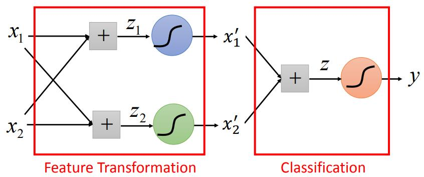

## 5 Logistic Regression
[ML Lecture 5: Logistic Regression](https://www.youtube.com/watch?v=hSXFuypLukA&list=PLJV_el3uVTsPy9oCRY30oBPNLCo89yu49&index=10)  
[pdf](http://speech.ee.ntu.edu.tw/~tlkagk/courses/ML_2016/Lecture/Logistic%20Regression%20(v3).pdf)

### function set
需要找到一个后验概率(posterior probulibily)  

使用Gaussian模型表示:  
(使用其他模型化简后可以得到同样结果)

  
  

### loss function

The most likely w\* and  b* is the one with the largest L(w,b)  
  
  
  

  

*Cross entropy*
  
两个distribution接近程度

Cross entribute:  

Loss function:  

为什么不用square error

### fnid the best function

  

### Logistic Regression and Square Error
如果使用方差作为loss function 那么有

model:  
  
Training data: :1 for class1,0 for class2  
loss function:  
  
带入样本左偏微分：  
  
带入样本计算偏微分总是(因为里面的f(x)&cdot;(1-f(x)))  
square error在图形上离目标较远的得分存在高地，无法通过偏微分找到目标

### Discriminative vs Generative
Logistic Regrission -> Discriminative 的方法
Gaussian Distribution -> Generative 的方法

function set model:  
P(c1|x)=&sigma;(w&cdot;x+b)

find the best function
Logistic Regrission :gradient descent找w,b
Gaussian Distribution :计算&mu;1,&mu;2,&sum;-1，然后计算w,b (假设了Gaussian/Bernoulli/naive)

数据少的情况下Generative效果常常比Discriminative效果要好
(参数量要少，可能性要少，更倾向给出更有规律的可能，过滤掉多的特征)

使用niave bayes计算：  
  

最终P(C1|x)&lt;0.5

生成性模型的好处
- 在假设概率分布的情况下，减少了对训练数据的需求，增强了对噪声的鲁棒性
- 通过概率分布的假设，可以从不同的来源估计出更强的噪声先验和类相关概率。(抗噪声 noise)
- 先验和类相关的概率可以从不同的来源估计。

- discriminative  
 假设posterior probulibily找参数

- Generative  
  formulation拆成Priors 和 class-dependent probulibily  
  可以通过不同来源计算得到参数(语言识别使用neuralnetwork 属于discriminative的方法 但是语言识别属于Generative的系统，可以通过收集文字信息计算Priors)

### Multi-class Classfication
vector 
<!-- scheler?? -->
inner product

Softmax会将数据限制在0-1之间加强大小数据的差异

Maximum Entropy类似 Logistic Regression的分类方法

### Limitation of Logistic Regression

neural network