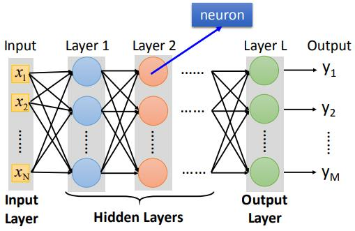
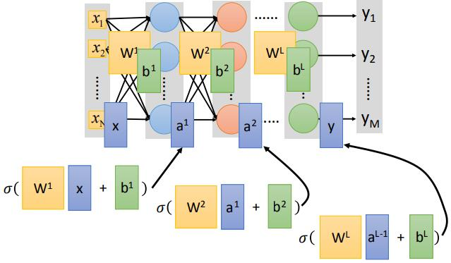

## 6 Brief Introduction of Deep Learning
[ML Lecture 6: Brief Introduction of Deep Learning](https://www.youtube.com/watch?v=Dr-WRlEFefw&list=PLJV_el3uVTsPy9oCRY30oBPNLCo89yu49&index=11)  
[pdf](http://speech.ee.ntu.edu.tw/~tlkagk/courses/ML_2016/Lecture/DL%20(v2).pdf)

- 1958:Perceptron(linear model)
  类似Logistic Regression，只是没有sigmoid的部分
- 1969:Perceptron has limitation(for MIT)
- 1980s:Multi-later perception
  - 和当今的DNN没有太大的区别
- 1986: Backpropagatino
  - 超过3个隐藏层就很难找到好的结果
- 1989:一个隐藏层就madel任何可能(SDN?)
- 2006:RBM initialization(breakthrough)然并卵
- 2009:GPU 加速
- 2011:用于语音识别
- 2012:赢得ILSVRC

1. define a set of function(Neural Network)
2. goodness of function
3. pick the best function

一个neuron的所有weights 和 biases叫做这neuron的parameter

1 Fully Connect Feedforward Network(全连接前馈神经网络)
  
input vector,output vector

Deep=Many hidden layers(>3 or >8 layers)

### Matrix Operation
  
&sigma; is activation function (sigmiod or other)  
Hidden Layers 看作 Feature extractor replacing feature engineering  
Output layers = Multi-class Classifier

### FAQ
- deep model 与非 deep model  
  非deep的model需要做feature engineering  
deep model不需要一个好的feature(选择)直接对数据学习，但是需要design network structure  
  DL在NLP上么没那么好(文本数据相对图像声音数据对电脑较好处理，dl的影响没那么明显)
- How many layers?How many neurons for each layer?  
  Train and Error + Intuition
- 自动学习network structure  
  Evolutionary Artificial Neural Networks人工进化神经网络
- 自己设计network structure  
  convolutional Neural Network(CNN 卷积神经网络)

### Loss of an Example
  
cross entropy:(输出k维向量)  
Total Loss:

Find the network parameters &theta;*</suo> that minimize total loss L  
Gradient Descent....

### Backpropagation

Backpropagation 计算neural network 的