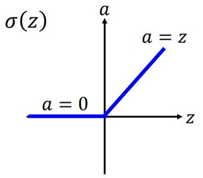
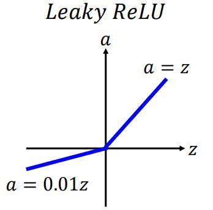
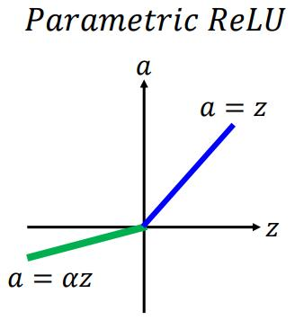
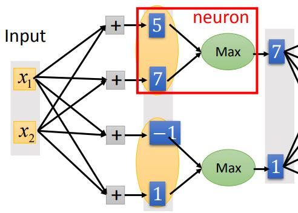
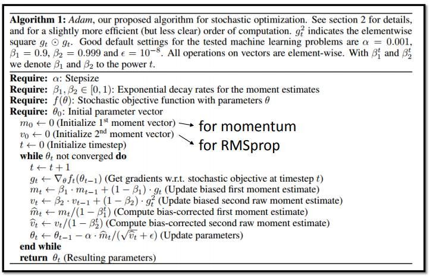

## 9-1 Tips for Training DNN
[9-1 Tips for Training DNN](https://www.youtube.com/watch?v=xki61j7z-30&list=PLJV_el3uVTsPy9oCRY30oBPNLCo89yu49&index=16)  
[pdf](http://speech.ee.ntu.edu.tw/~tlkagk/courses/ML_2017/Lecture/DNN%20tip.pdf)

本来希望先讲这节课，再讲CNN的。但是实际上已经讲过CNN了(下一集 ML Lecture 10: Convolutional Neural Network)  

在CNN的课上留下的问题
1. Max Pooling 如何微分问题
2. L1 的regularization是什么样的

### Recipe of deep learning

CNN学习模型后如何调整模型
1. Good Relult on Training Data?
    - (对于k-NearestNeighbor或者Decision Tree学习率很容易就100%了，不太需要这一步)
    - 可能的原因local minimum/saddle point/plateau(局部最小值/鞍点/高原)
    1. New activation function
    2. Adaptive Learning Rate
2. Good Result on Testing Data?
    - overfitting问题 使用technique处理overfitting问题后可能会让Training Set上的结果变坏，需要重新检查Training Set 上的表现
    1. Early Stopping
    2. Regularization
    3. Dropout

这里李宏毅老师定义的Underfitting是由于模型本身复杂度不够(参数不够多)从而无法处理问题的情况

### Vanishing Gradient Problem
1980年代的sigmoid function

- 靠近output的参数对最后Loss function的微分更大，靠近input层的参数偏微分很小，更新很慢。output的参数已经converge在local minimum了,input的参数还是random的状态。(这时候前级的参数都是随机的，相当于数据是被打乱的状态，不经没有使数据更好反而还更糟了)
- 和使用sigmoid function有关  
  sigmoid function对较大的输出反应不明显(输出大时微分值较小)，所以对于输出大的节点的参数更新也会变很慢(对数据影响大的反而很难更新)

最早解决这问题用的是RBM的方法，一层一层train

### ReLU
Rectified Linear Unit

1. 计算快，没有sigmoid里面的exponential项
2. 仿生
3. ReLU也相当于无穷多的sigmoid拟合出来的结果
4. 解决Vanishing Gradient 问题(因为是线性的 没有使用sigmoid那样递减的问题)

***ReLU用分段函数来处理non-linear问题***

### ReLU-variant

**Leaky ReLU**  
在z&lt;0时能够更新参数  

**Parametric ReLU**  
用Grandient Descent获得负半轴的斜率  

**Maxout Network**  
通过学习得到的activation function  
(like Max Pooling)  

Activation function可以是任意的分段线性凸函数  
里面的pieces取决于activation function前输入多少个元素

**Maxout-training**  
更新max选中的输出的参数

### adaptive learning rate

**Adagrad**  

**RMSProp**  
来自minton Mooc的course  
和上一项的加权平方和开根号(对二次方做一阶滤波后开方)  

local minimum/saddle point/plateau问题  
因为参数多，维度多，local minimum的问题可能会很少见

**Momentum**  
势能  
对过去的差分项衰减 累加  

**Adam**  
RMSProp+Momentum  

### Early Stopping
typical method  
使用Validation set 来verify  
test data永远只是用来评估展示效果的，不要引入到学习过程中去train或者做为停止学习的判断条件

### Regularization
L2 norm 范数 todo  
和Adagrad有关系?? todo  

**L2 Regularization**

The New Loss function:  

&Vert;&theta;&Vert;2就权重是平方和项

Regularization是位了让模型更平滑，所以不考虑bias项

Gradient:
  
updata:

**Weight Decay**

Ragularization 效果和其他方法比起来(SVM 支持向量机)不是特别明显  
现在一般是用接近0的数值来初始参数，使用Early Stopping的效果可能也很像  
SVM 明确的把Ragularization写在objective function里，SVM要解一个convex optimization 问题，SVM一步到位所以没法Eatly Stopping

**L1 Regularization**

  
Gradient:
  
Updata:

L1每次减去固定值，L2每次减去一定权重  
L2对大的数值抑制比较强，对小数值更新较慢，参数接近0  
l1的参数会比较分散

### Dropout
specific design for seep learning

模型train完后overfitting,加入Dropout结果再继续训练  
- 每次updata前对input neuron 和 hidden neuron做概率为p的丢弃  
(Dropout时train结果会变差)
- Testing的时候不Dropout,weight要乘以(1-p)

终极的ensemble的方法？？

大模型bias准 variance大,  
每次Dropout后相当于train了一个小一点的模型，train过多次后相当于train过了多个模型，对结果做了平均  
random forest也是这种思维 用多个decision tree避免overfitting

或者每个minibatch都会有不同的结构

对于使用sigmoid activation function或者多层的时候按概率Dropout和参数乘以一个权值并不能完全等价(equivalent),都是结果还是work  
所以使用接近linear的时候Dropout效果会更好(如ReLU MaxoutNetwork)
