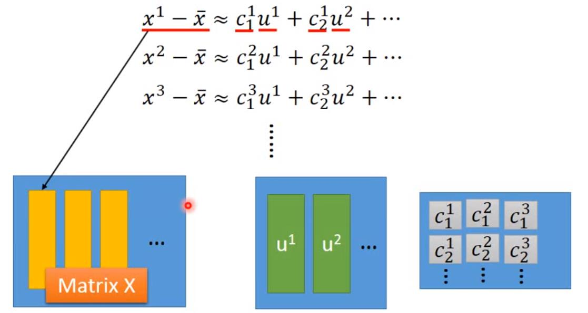
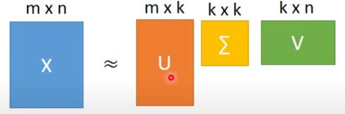
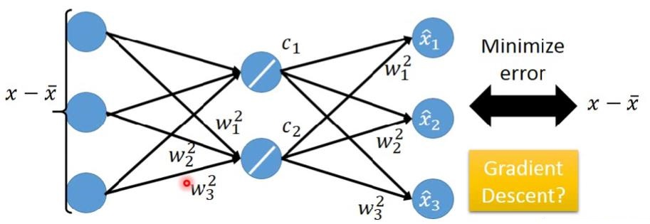
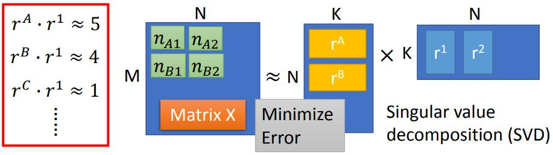

## 13 Unsupervised Learning - Linear Methods
[13 Unsupervised Learning - Linear Methods](https://www.youtube.com/watch?v=iwh5o_M4BNU&list=PLJV_el3uVTsPy9oCRY30oBPNLCo89yu49&index=22)  
[pdf](http://speech.ee.ntu.edu.tw/~tlkagk/courses/ML_2017/Lecture/PCA%20(v3).pdf)  
[pdf](http://speech.ee.ntu.edu.tw/~tlkagk/courses/ML_2017/Lecture/MF.pdf)  

- Clustering & Dimension Reduction (集合和维度减少)  
- Generation

Dimension Reduction可以减少feature，得到关键特征输出  
Generate 可以给random，生成一个复杂的多维的‘原始数据’

### clustering
自动分类
#### K-means
- Clustering X={x1,...xn,xN} into K lusters
- Initialize cluster center ci,i=1,2,..K(K random xx from X)  
  设置类别1到K，随机取K个数据作为cluster的中心
- Repeat
  - For all xn in X: 
  - Updating all ci:

还是根据输入的分布自动做cluster??

#### Hierarchical Agglomerative Clustering
Hierarchical Agglomerative Clustering(HAC) 层次聚类
- build a tree
  - 计算最相似的data
  - 合并
- pick a threshold

对应该分几类提供了一个参考

- Distributed repersentation 发布表达式  
  高维的 多特征值的东西，用少维度的属性来表示 就是 Dimension Reduction

样本在不同分类特征中所占的权重
cluster A 0.75
cluster B 0.19
cluster C 0.06

### 如何 Dimension Reduction
1. feature selection (选择特征 直观的拿掉一个没什么数据的维度)
2. Principal Component Analysis (PCA 主要组成分析)  
   通过一堆多维的输入数据，找到转换矩阵，把数据降维  
   经过转换矩阵w1后，数据投影到维度轴上的奇异度最大  
   第二维要求与第一维度垂直 即 w1 &middot; w2 = 0  
   最后会找到一个orthogonal matrix 正交矩阵  
   可以使用 Lagrange multiplier (拉格朗日方程) 或者 Gradient Descent (梯度下降) 来求这降维矩阵  
   需要限制(即 2-norm / L2-regularization)

转换后的向量等于输入数据x乘以一个矩阵 W z = Wx

第一个主要特征维度的向量 z1  

第二个主要特征维度的向量 z1  

所有维度矩阵写一起  
 (orthogonal matrix 正交矩阵)

拉格朗日方程 解降维矩阵方法 或者 Gradient Descent 求解  ...

z = Wx  
经过降维转换后 z 的 covariance 会是一个 diagonal matrix ,使得数据decorrelation 不同 dimension 之间 covariance 为0  
如果结果z给其他模型使用时可以假设不同维度数据 没有 covariance <u>减少参数量</u>

ⓑ 
**方差 协方差**
- 方差 var 描述期望和数据中心相同时的离散程度
- 协方差 cov 描述任意两个数据的离散程度

ⓒ S = Cov(x)

  

#### find w1
最终得到 w1 maximizing ： 
  
并且需要限制：

对于 S=Cov(x)有
1. Symmetric // 对称
2. Positive-semidefinite // 半正定
3. (non-negative eigenvalues ) // 非负特征值

使用 Lagrange multiplier 来解决  

最终 W1 是 S 矩阵最大 eigenvalue (特征值) &lambda;1 对应的eigenvector (特征向量)

#### find w2

w2 maximizing ： 

w2是矩阵S 的 2nd eigenvalue (特征值) &lambda;2 对应的eigenvector (特征向量)

#### 计算结论
z=Wx  
Cov(z)=D // Diagonal matrix

PCA输出的data不同的dimension没有correnlation(相关性)可以让后面的模型用简单的模型来处理数据，减少 overfitting

// todo math

### PCA Another Point of View
PCA 另一种直观的描述

// \bar x x&#772;

// PCA 和一般的 deep learning 效果有什么区别？ 更多概率模型上的限制 对多维分散的数据友好 PCA是to,deep learning是to result的

每一个PCA分离出来的维度都是一个在数据中广泛存在的基础组件 Basic Component，

Basic Component is u  
x &ap; c1u1 + c2u2 + ... + cKuK + x&#772;

一张img 可以用表示

x - x&#772; &ap; c1u1 + c2u2 + ... + cKuK  = x&#770;  

Reconstruction Error (重建错误):    

Error:  

以上loss 的解就是PCA找到的解  
  
{w1,w2,...,wK} is the component  
{u1,u2,...,uK} minimizing L

  
黄色matrix 是原始数据 每一纵列即为每一笔data的 xi-x&#772;  
绿色matrix 是PCA分离出的特征矩阵，每一列即代表一个特征img(component)  
灰色matrix 是每一笔data对应pca特征的的权重，每一纵列即为每一笔data，一列里每一个数据代表这笔数据对应一个特征的权重。水平列数为几笔data的数量，行数为PCA特征component的数量

  

第一图中的component矩阵即2图的U矩阵， 一图的灰色矩阵即二图的 &Sigma;&sdot;V  
SVD: http://speech.ee.ntu.edu.tw/~tlkagk/courses/LA_2016/Lecture/SVD.pdf

要minimize reconstruction error &space;\&space;x-\bar&space;x" title="\bg_white \hat x = \sum_{k=1}^Kc_Kw^k \ <==> \ x-\bar x" />  
因为ck是orthonormal的  
所以 ck=(x-x&#772;)&sdot;wk

可以表示为一层的 nerual network, (x-x&#772;)乘以一个一层的nerual network,还是和之前的(x-x&#772;)比较接近，这个叫做 **Autoencoder**

  

可以使用 Gradient Descent 代替PCA来得到 component matrix。但是没法保证 Wk 之间是垂直的,recostructino error也不会比PCA更小。  
linear的情况下使用PCA会更快，但是unlinear的情况会使用 Gradient Descent 和多层的 hidden layer 来得到 component matrix (deep autoencoder)。

### PCA 的弱点

1. PCA 只考虑data的分布情况，data variance 最大，如果 分类之间的维度是有相关性的，分界线不是正交data variance分布的情况时，PCA降维后会使得分界消失(如果维度不够的话就不够还原原本的数据分布)。  
引入label 解决这个问题 LDA(linear discriminant analysis ) 是supervised的

2. PCA 是linear的，例如S型的高维数据会被投影混到一起，

### PCA 的实用

要使用多少个 principal component 取决于你的问题  
例如 做visualization,会project到2维  
计算每一个 principal component 的 eigenvalue &lambda; (特征值)，取影响大的维度。

loulier 利群值

**PCA - MNIST**
在MNIST中 使用PCA得到的一个component weight 是一张图片 叫 Eigen-degit，做linear combination 就可以得到各种 degit

为什么PCA得到的weight是整张图片而不是由部分组成的component: weight 的值有正有负，更倾向于让方差最大 maximizing Covariance  
Non-negative Matrix Factorization (NMF) 非负值分解

### Matrix Factorization

不同的object有受同样的latent factor影响，

御宅数量 M，动漫人物数量 N，隐藏属性 K,
使用SVD求向量 ra-n r1-q  

如果数据中含有未知的 missing data 数据，可以使用 Gradient descent 只计算有数据的data
  
ri御宅  r1-q动漫人物  
nij购买的数量

更精确的描述：
rA&sdot;r1+bA+b1  
rA 御宅属性点  
r1 动漫人物属性点  
bA 御宅购买意愿  
b1 动漫人物畅销程度

也可以加 regularization,如 ri rj是sparse的，只萌一个属性 加L1 regularization

用在 Topic analysis 上时叫做LSA(Latent Semantic Analysis)  
文档 - 词汇 - 词频 表 词频也可以乘上权重  
如何确定词频的权重，可以使用 inverse document frequency (IDF) 有多少比例的文档有使用这词汇

- Probability latent semantic analysis (PLSA)
- Latent Dirichlet Allocation (LDA)

- Multidimensional scaling (MDS) 不需要把每个data都表示为 feature vector,只要找到feature vector 和feature vector 的 distance 就可以做 Dimensionality reduction
- probabilistic PCA 机率问题PCA
- Kernel PCA 非线性版本PCA
- Canonical correlation Analysis (CCA) 不同类型的数据源 如声音和图像
- Independent Component Analysis (ICA) PCA找orthogonal 的component,ICA找independent 的component
- Linear Discriminant Analysis (LDA) supervise 的方法