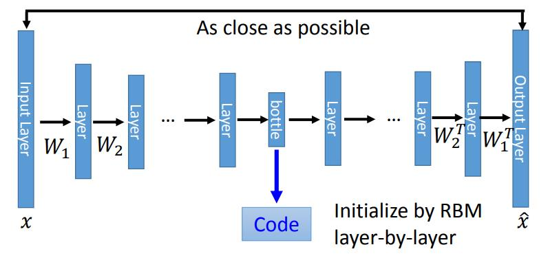

## 16 Unsupervised Learning - Auto-encoder

[16 Unsupervised Learning - Auto-encoder](https://www.youtube.com/watch?v=Tk5B4seA-AU&list=PLJV_el3uVTsPy9oCRY30oBPNLCo89yu49&index=25)  
[pdf](http://speech.ee.ntu.edu.tw/~tlkagk/courses/ML_2017/Lecture/auto.pdf)  

img = NN Encoder => code (维度更少)// 特征提取 压缩信息  
code = NN Decoder => img  
code 又是buttleneck layer

PCA: img vector  =W matrix=> c =WT=> x&#770;

### Auto encoder be deep

最早要使用RBM做layer wise 的initialization才行，不然会tranin坏掉。  
可以让 buttleneck layer 两边的weight是镜像的，互为 transpose。但不是必要的。

同样使用PCA 和deep autoencoder 处理MNIST 到2维，PCA 的数据是混在一起的，而deep autoencoder可以把数据分开。

**用在文字处理上**
用 Vector space Model 做文字搜寻 

把每一个文章用vector表示,搜索单词也表示为一个vector。然后做 inner product 或者 cosine similarity

如何把一的document 表示为一个 Vector呢
1. bag-of-word 再在单词上乘weight, 这养没法结合上下文的语义
2. 使用deep autoencoder 将文章处理为低维  
    和使用LSA(latent semantic analysis潜在语义分析)相比，LSA处理后是混在一起的

**用在图像搜索上 以图找图**

**用在 pretraining 上**  
做参数的 initialization

例如做 MNIST 的时候，输入784 dimension 数据最终输出10维数据，模型结构为  
imput 784 -> 1000 -> 1000 -> 500 -> 10  
可以先使用 auto encoder 做 784 -> 1000 -> 784, 这里encoder维度大于输入维度时要注意避免learn一个类似 identity matrix 出来，所以要加一个 L1 的 regularization ，让矩阵是 sparse 的,输出只有某几维有值其他都是0。
载用第二层的1000维数据 做 1000 -> 1000(3) -> 10000 的 auto encoder  
再用第三层的1000维数据 做 1000 -> 500(4) -> 10000 的 auto encoder  
再用 random initilization 做 500 -> 10 的 weight
这样做 network 的 初始化,  
再重新 back propagation 整个网络 fine tune 