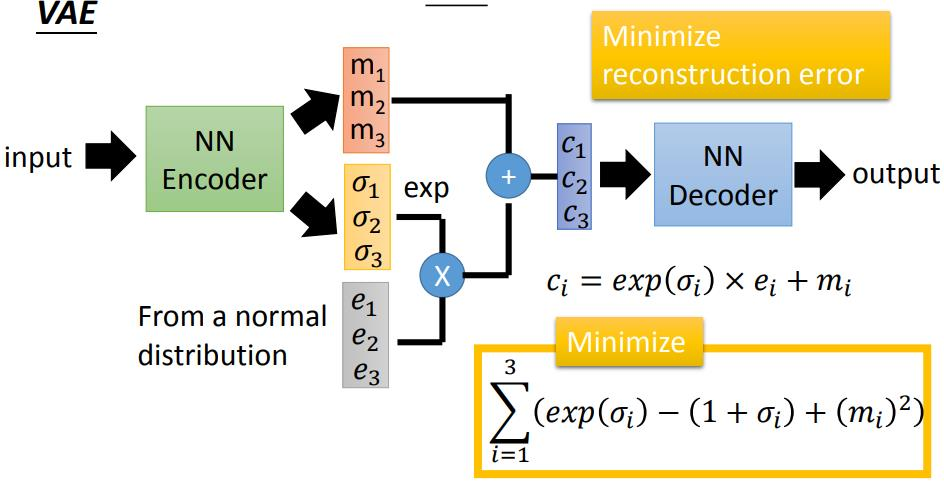

## 18 Unsupervised Learning - Deep Generative Model (Part II)

[18 Unsupervised Learning - Deep Generative Model (Part II)](https://www.youtube.com/watch?v=8zomhgKrsmQ&list=PLJV_el3uVTsPy9oCRY30oBPNLCo89yu49&index=27)  
[pdf](http://speech.ee.ntu.edu.tw/~tlkagk/courses/ML_2017/Lecture/GAN%20(v3).pdf)

- m 是实际的encoder输出
- &sigma; 是方差 variance ?? 自动learn出来的?? 
- e 是 mormal distribution sample的值 随机的权重

相当于把 sample data encode附近加上一些noice 扩散。

在minimiae上有 exp(&sigma;i)-(1+&sigma;i) 项,此项最小为0。  
所以对于exp(&sigma;i)最小为1，保证noice不为。  
(mi)2项是加了 code 的 L2 regularization 让结果 sparse。 

把一笔data point x 模拟到周围附近的概率分布 P(x)

**Gaussian Mixture Model**  
多个高斯分布不同weight累加起来  

x|m ~ N(&mu;m, &sigma;m)  
决定mixture的数目  
在 Gaussian Mixture Model 中，通过一把data x来估计这些 Gaussian 的weight和mean和variance。 使用 EM Algorithm 

VAE 就是 Gaussian Mixture Model 的 distribution representation版本