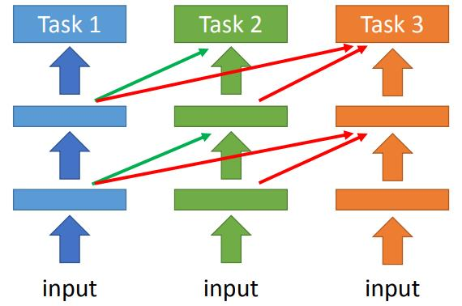
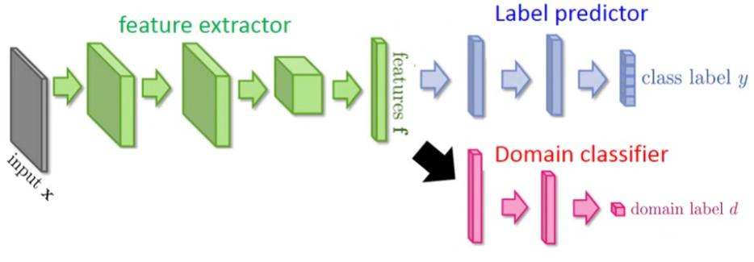
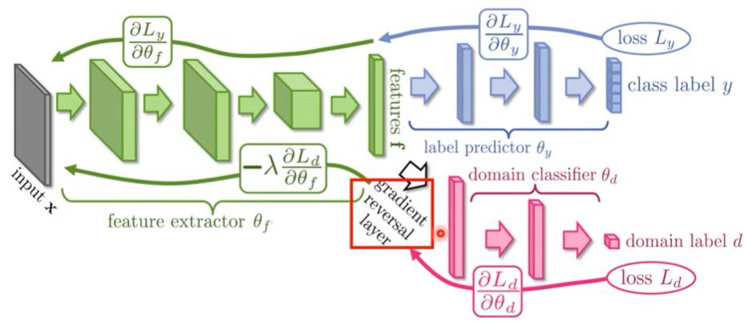

## 19 Transfer Learning

[19 Transfer Learning](https://www.youtube.com/watch?v=qD6iD4TFsdQ&list=PLJV_el3uVTsPy9oCRY30oBPNLCo89yu49&index=29)  
[pdf](http://speech.ee.ntu.edu.tw/~tlkagk/courses/ML_2016/Lecture/transfer%20(v3).pdf)


使用没有直接相关的data帮助train

例如训练猫狗分类
1. 输入distribution 类似的其他动物图片(label是无关的)。domain 一样 task 不一样  
2. 输入漫画的猫狗， domain 不一样 task 一样

target data 和任务相关的数据  
source data 和任务不直接相关的数据  

- source data labelled
    - target data labelled
        - [Model Find-tuning](#Model-Find-tuning) 
            - [Conseervative Training](#Conseervative-Training)
            - [Layer-transfer](#Layer-transfer)
        - [Multitask Learning](#Multitask-Learning)
        - [Progressive Neural Networks](#Progressive-Neural-Networks)
    - target data unlabelled
        - [Domain adversarial training](#Domain-adversarial-training)
        - [Zero-shot learning](#Zero-shot-learning)
        - [Convex combination of Semantic Embedding](#Convex-combination-of-Semantic-Embedding)
- source data unlabelled
    - target data labelled
        - [Self-taught learning](#Self-taught-learning)  
            和一般的 semi-supervised learning 不太一样，labeled data 和unlabeled data 不太相关
    - target data unlabelled
        - Self-taught clustering


### Model-Find-tuning
有label 的 target data 很少时，不相关的 source data 会不会有帮助

当target data 只有几笔 example 时，叫 **One-shot learninig**

语音上的典型例子 speaker adaptation (语音适应)  
对某一个人的语音数据很少，其他人的语音数据有很多  
用source data 训练一个模型，然后用 target data Fine-tune 模型

只关注Targed domain 上效果好不好，不在意之前Source domain 上的效果
### Conseervative-Training

 有大量的source data, 不同人的声音都有录入。有少量的target data，某个人的几十条声音。  
直接 find-tuning train会train坏掉，可以加一些 constrain 新的模型和旧的不要差太多，加一个regularization
1. 新model和旧model看到的同一笔data时ouput 越接近越好
2. 新model和旧model的 L2 norm 差距越小越好

### Layer-transfer

用source data train 模型，只保留几个layer 并且固定住，重新train 没有copy 的layer 的参数  
一般声音模型 保留后面的layer 只train输入的layer (对数据前面预加工不一样)  
而图像模型 保留前面的layer 只train输出的layer (后面图形的排列组合不一样) 

Bengio

对于少量的traget data 不因该update 太多层，因为数据少 比较特殊性覆盖范围也不够大，不因该改动太多的network 结构  
如果是 重新train一些layer 并且fine-tuning copy layer ， 结果会有所提高 好一些 (即使target data非常少)  

模型train 过程中前后的layer参数是彼此配合更新的

### Multitask-Learning

同时注意 Target domain 和 Source domain 的效果

- 共用输入的几层layer  
可以用layer transfer的方法，实际上train 了两个net work，task A 的问题使用 A 的network 来解， 对task B的问题使用B的network。
- 共用中间的layer  

用在多语言的语音辨识上，口腔结构特征是相同的  
只需要一般的 target data  

### Progressive-Neural-Networks

不同task train 出不同的network, 对之 transfer 的网络借用其他网络layer 输出的data乘一个weight 用到自己网络里面来。  
怎么确定引用过来的数据对接到哪里??  

  


### Domain-adversarial-training
领域对抗学习 (去除领域特征)

- Source data: (x<sup>s</sup>, y<sup>s</sup>) 当作training data
- Target data: (x<sup>t</sup>) 当作testing data

如 MNIST 数据和 着色的数字图片数据

**两者非常 mismatch (不匹配)**，数据结构 网络结构不太一样  

把network 当作 feature extractor,输入的前面几层是在抽 feature,后面是在做 classification


前级网络用来去除领域特征，统一 encode 为必要的 feature。后级network 用来做 classification  

Label predictor 标签预测
Domain classifier 做领域区分  
feature extractor 做特征提取  
  domain classifier 对feature extraction 做 optimization backward path 时用 gradient reversal 来做,乘一个负号 和正常的 gradient update 相反。  
  domain classifier要尽力区分不同的领域。但是对 feautre extraction 更新数据时， feautre extraction尽力不让 domain classifier 区分出来。这一层就作为特征提取的分界线。


前级混合encode 特征， 后级通用分类




### Zero-shot-learning


- Source data: (x<sup>s</sup>, y<sup>s</sup>) 当作training data
- Target data: (x<sup>t</sup>) 当作testing data

两者是**Different tasks**, target data 在source data没有出现过

例如语音上遇到没见过的词汇，提取成 phoneme  
建一个phoneme 与 label(word) 的对应关系 叫 lexicon 词典,辨识出phoneme 查表  
即使单词表里的单词没有在training data里出现过也可以被识别出来

在图像上
---
抽象成 work space  
encode 思想  
用已知的 knowledge 列属性表

把动物和对应的属性列在表上，training network 去匹配属性

如果attribute特别多，把image 变成embedding space上的一个点， attirbuet 也匹配为 embedding 上的一个点

```
img          x -转换到emmbedding space-> f(x)  
label attribute vector y -转换到emmbedding space-> g(y)  
```

可以借用word vector 来做 attribute 的embedding  


k 是自己定的值  
图片的 img embedding vector 到最近的不匹配的 arrt embedding vector 的距离 要比  
到匹配的 attr embedding vector 的距离要大过 k

### Convex-combination-of-Semantic-Embedding)

凸组合语义嵌入

直接用一个 off-the-self 的语音辨识系统 和 word vector， 
直接train一个img 转label 的model, test 的时候把结果的word 的对应的概率生成word vector  
用 word vector 的embedding space 去匹配词语


对于文字问题

arXiv

已有 英->韩 韩->英 英->日 日->英  
能够自动生成  日->韩 韩->日

\[英 日 韩\] -sequence language-> \[英 日 韩\]


### Self-taught-learning

有足够多的unlabel的 source data，可以去learn 一个 feature extractor ( 如使用 sparse coding 或者 auto-encoder)  

