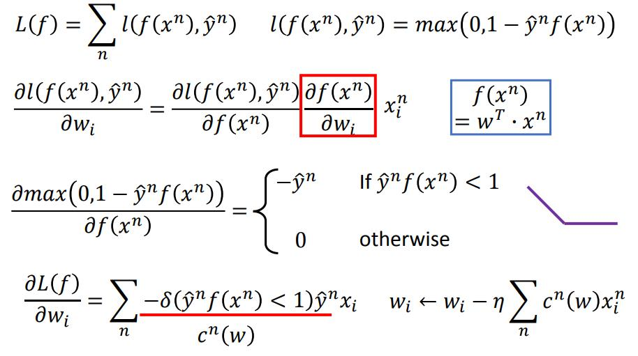
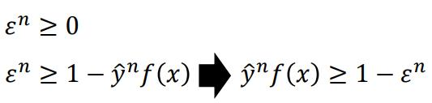
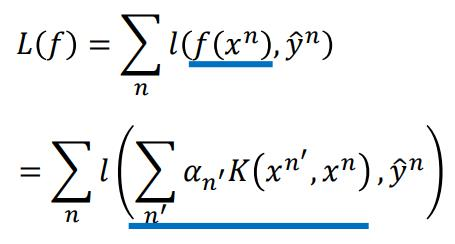

# 20 Support Vector Machine (SVM)

[20 Support Vector Machine (SVM)](https://www.youtube.com/watch?v=QSEPStBgwRQ&list=PLJV_el3uVTsPy9oCRY30oBPNLCo89yu49)  
[pdf](https://speech.ee.ntu.edu.tw/~tlkagk/courses/ML_2016/Lecture/SVM%20(v5).pdf)  

[什么是 SVM（支持向量机）？ KnowingAI知智](https://www.bilibili.com/video/av373770998?from=search&seid=4130925215194615253&spm_id_from=333.337.0.0)

Hinge Loss + Kernel Method => Sepport Vector Machine (SVM)

(Kernel Trick 核技巧 方法)

g(x) = \[-1,1\]  
f(x) 是警司函数  
&sigma;(g(x),y&#770;) = \[if f(x)==y&#770; is 0 ; else is 1\]  
l(f(x),y&#770;) 是近似方法  

1. square loss  
l(f(x),y&#770;) = (y&#770;f(x)-1)2 => square loss 方差损失函数  
不合理，同binary classification 的loss 问题一样，距离分割线较远的数据会有很大的loss

2. sigmoid + square loss  
l(f(x),y&#770;) = (&sigma;(y&#770;f(x))-1)2 // &sigma;() 表示 sigmoid function  
在极大和极小的时候 gradient 很小

3. cross entropy  
l(f(x),y&#770;) = ln(1-exp(-y&#770;f(x)))

---
 
**hinge loss**: 

if positive example y&#770; = 1: max(0,1-f(x)) , f(x)>1 
if negative example y&#770; = -1: max(0,1+f(x)) , f(x)<-1 

like one-shot learning

hinge loss 对比 cross entropy 比较不害怕 outlier (离群值)

### linear SVM

step 1: function model is <u>linear </u>  

 is new **w**  
 is new **x**

step 2: loss is hinge loss + regularization term

  
是个convex function,每一项都是convex function 

step 3: optimization gradient 或者 

linear SVM 与 logistic regression 的区别基就只有 Loss function  不同  
linear SVM Hinge Loss  
logistic Cross Entrropu  

SVS 的 Function (Model) 也可以不是linear 的， 可以是deep 的

### optimization
#### 用 Gradient Descent
Gradient Descent train SVM 的方法 叫做 Picasso

#### 用 //

用 notation epsilon n 替代   

在 **Minimizing loss function L** 的条件下 会等于

让 y&#770;nf(x) > 1,但是有时候这个条件满足不了，用 &epsilon;n来放宽这个条件  
&epsilon;n 被叫做 slack variable 松弛变量  
&epsilon;n 必须 >=0

### 二元表示

更关注边界附近的数据

用上面 minimize loss function 找出来的weight 就是 data 的 linear combination  
就是对 data 的所有数据 做 wx+b 的操作，每一笔数据都有各自的 w 和 b  
可以用 Lagrange multiplier解出证明  

(1)  

就是对每一笔数据线性操作后累加  

可以算出 Gradient Descent 的式子为：  

在使用hinge loss 时，如果他作用在max=0的region的话 cn(w) 就会是0，会有很多数据对 gradient update 是没影响的  
最后解出来的 Linear Coombination 的 weight 可能会是 sparse 的  
很多的data point 对应 (1)式中的 &alpha;* 是0  
&alpha;* 值不等于0的data point 就叫做support vector  

所以 svm 相对于其他方法(如 cross entropy) 更 robust。对 outlier 不敏感  
不是 support vector 的 data point 拿掉对模型一点影响都没有  

把w 写成 data point 的 lineat combination 方便使用 Kernel trick

### Kernel Method

带入 step 1 function model  

定义 kernel function 

step 2,3 find  minimization loss function L

 

kernel-trick 不只能用在SVM 里面， Linear Regression 和 Logistic Regression 都可以用

### Kernel Trick

优化求解运算的方法  

先将x 做 feature transform 为 &Phi;(x)

对一笔x 先做 feature transform 再去 apply Linear SVM 

对一笔x 先做 feature transform 再去 做inner product 等同于先做 inner product 再平方

直接计算 x 和 z inner product 后带近 Kernel Function 以后的 output 比先做 Feature Transform 再做 inner product 更快

### Radial Basis Function Kernel

// todo

展开后会变成无穷多维  
容易 overfitting  

### sigmoid kernel

// todo 

只要定义一个Function 可以 evaluate x 和 Z 的 similarity 就可以当作 kernel来用。并且要能够表示为 两个vector 做 inner product 的结果    

Mercre's theory 可以确定什么 function 可以作为 kernel function。

### SVM related methods

就是针对不同分布形状的支持向量模型

- Support Vector Regression： 带状分布
- Ranking SVM: 排序问题
- One-class SVM: 单类问题 集中在一个区域

### deep learning 和 SVM 的差别

deep learnint 前几个layer 做feature transform,最后的layer 做classifier  
SVM 先apply 以恶 Kernel Function 把feature 转换到一个 height dimension 上面，然后用 Hinge Loss apply linear classifier  

SVM 的 kernel 是 learnable 的，可学习的  

可以有好几个不同的 kernel 把不同 kernel 加上weight combine起来，这weight 是可以learn 的  

如果只有一个kernel 的时候，SVM就像是只有一个 hidden layer 的 neural network  
当把kernel 做linear combination 的时候就像有两个hidden layer 的 neural network  
