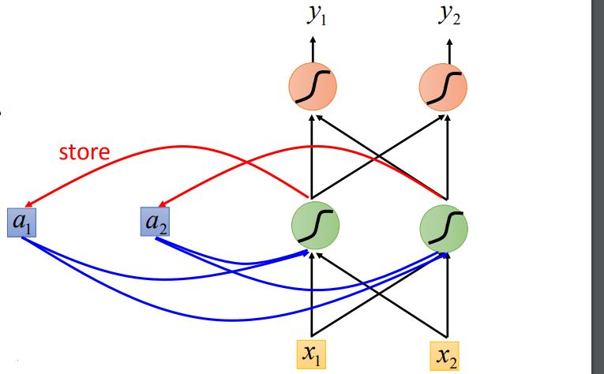

## 21-1 Recurrent Neural Network (Part I)
[21-1 Recurrent Neural Network (Part I)](https://www.youtube.com/watch?v=xCGidAeyS4M&list=PLJV_el3uVTsPy9oCRY30oBPNLCo89yu49&index=30)  
[pdf](http://speech.ee.ntu.edu.tw/~tlkagk/courses/ML_2016/Lecture/RNN%20(v2).pdf)

### slot filling

智慧客服根据上下文提取指定语义的信息。

用 word vector 来表示输入词汇。

或者 Beyond 1-of-N ecoding： 普通 1-of-n encoding 加上一项 “other” 项。表示不在词汇列表中的词汇。

或者用词汇的 n-gram 来表示输入词汇： n个字母连续出现的片段，从语料库中通过概率统计整理出来。在word中 出现过的片段对应的 dimention 为 '1'。

y1 单词属于slot 1 的机率分布  
y2 单词属于slot 1 的机率分布  
每一次输入都会把 neuron 的输出结果保存到memory中

elman network 每一层3都保存 memary  
jordan network 只把输出层保存 memory  

elman network 保留中间层的memary 数据是没有目标的，不确定会存什么，参数更多容易overfitting。

### Bidirectional RNN
双向RNN，一个句子 同时从正向和反向train RNN网络。  
对于某个位置的 word 输出，是两个方向的 neural network 的输出再接到 output layer 上,再得到输出。  
可以同时考虑到前面和后面的文本  

### Long Short-term Memory LSTM

Input Gate: 输入门  
Output Gate: 输出门  
Forget Gate: 遗忘门 如果是 1 的话保留Memory

因为有 input gate 控制，所以memory 没那么快被更新，所以是相对long 的 shot term memory。

LSTM 结构为什么这么复杂，有是什么好处

RNN 的梯度累乘会让 一个weight对data 随着 sequenec 的增加 被无限放大，w1000

RNN 网络有的地方很崎岖， 有的地方很平坦，从平坦的地方到崎岖的地方 学习率很大加上梯度很大，update 就会爆炸  
做到 handle gradient vanish(处理梯度消失问题)，拿掉平坦的区域避免 gradient explode(梯度爆炸)。

