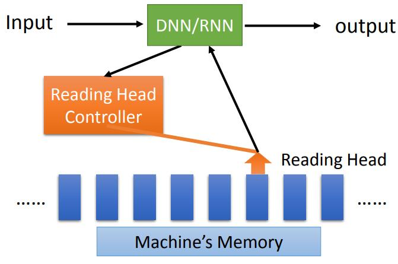
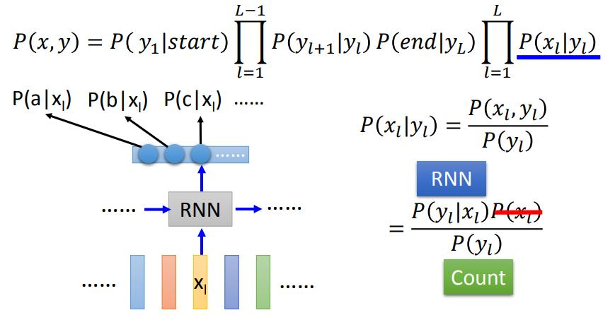

## 21-2 Recurrent Neural Network (Part II)
[21-2 Recurrent Neural Network (Part II)](https://www.youtube.com/watch?v=rTqmWlnwz_0&list=PLJV_el3uVTsPy9oCRY30oBPNLCo89yu49&index=31)  
[pdf](http://speech.ee.ntu.edu.tw/~tlkagk/courses/ML_2016/Lecture/RNN%20(v2).pdf)

### RNN 如何learning

Recurrent Neural Network (RNN) 要如何做 learnint

要定一个cost function,evaluate model 的parameter 好坏。

给word sequence 做 slot filling 时输入顺序不能打乱  
每一个时间点 RNN output 和 reference vector 的 cross entropy 和就是loss

依然是 gradient descent 

在LSTM 中做gradient descent 的方法: Backpropagation Through Time (BPTT)  
因为RNN 要考虑time sequence 问题（某一时刻的输出会有之前数据和参数和影响）

RNN 的training 是比较困难的， 学习曲线崎岖，平坦和崎岖的地方变化很快  
平坦的地方学习率大，突然到崎岖的地方 gradient也大 更新的数据就大到溢出了  

解决RNN error surface 崎岖方法
- Clipping 限制更新的最大值

为什么这么崎岖，和Backpropangation through time 有关  

因为记忆的关系一直乘以系数，导致RNN梯度爆炸,权重大于1 多次循环后输入x结果趋于无穷大，权重小于1时，多次循环后输入x 的结果趋于0

ReLU 在RNN上的performanec 是比较差的，


LSTM 解决error surface 崎岖的问题，拿掉 error 低的地方，让error 都比较高,让learning rate 可以设小一些  


```
LSTM 为什么可以解决 gradient vanish 问题 

是把cell &sdot; w 加上input 再回到cell里面( 有什么区别?)  
LSTM 中 如果weight 可以影响到Memary(cell)里的值，这个影响就会一直存在，除非 forget gate 决定要拿memarty里的值洗掉  
RNN 在没在时间点 memary 里的值都会被format掉

LSTM 97年的一个版本是没有forget gate的，后来才被加上去（拿memary 都是用h 来传递的？）  
训练的时候要给forget gate 特别大的bias,确保gorget 在大多数情况是关闭的，只有少数情况会被format掉
```

### Gated Recurrent Unit (GRU)
合并了 input gete 和 forget gate，减少了参数，不容易overfitting,training的时候比较 robust

### 其他解决 gradient vanish 的方法

- Clockwise RNN
- Structurally Constrained Recurrent Network (SCRN)

用一般的 RNN 时 使用 identity matrix 初始化 transition 的 weight 和 ReLU 的 activation function 可以得到更好的 performance


### Application
之前的 slot filling 问题， 每次input 一个word ,output一个slot 的label，给每一个词标注在句子中的成分，输入和输出一样多。  


**多输入一输出** input sequence output vector  
sentiment analysis (情感分析)  
把 character sequence 跑一边RNN 把最后一次的一层 hidden layer拿出来做 再通过transform 得到 表示 positive/negative  程度的结果 

key term extraction (关键词提取)  
document character sequence --> Embedding layer -> RNN  
把最后一个的output 拿出来做 attention （注意力机制？）


**long to shorter**  
语音辨识  
input acousitic feature sequence (固定0.01s的语音切片表示为vector)  
output character sequence  
一般RNN 每一个input vector 都会有一个 character，这样输出的太多了  
***trimming*** 删除重复的东西  
***CTC (Connectionist Temporal Classification)***  输出分类里添加一个null 分别文字中间的分隔  
训练时 怎么知道 acousitic feature 是怎么分隔的,怎么知道从文本对应到 acousitic sequence 的什么位置 ？  
穷举所有可能的位置。有专门的算法处理


**Many to Many**  
不一定哪个长  

Mechine Translation (机器翻译) 

RNN(LSTM) 网络依次读取完整个句子后把最后一个输出作为下一个输入，让网络自动学习输出，直到输出结束标识
也有用在语音辨识上当是有CTC强  

可以语音转为翻译后的文本吗？  
是可以的，这样在没有台语语音模型时也能把台语声音转英文 (No Limitation)  


**Beyond Sequence** 用来产生 Syntactic parsing tree (语法分析树)  
会用到 structure learning 的技术  
可以把语法树描述为一个 sequence,用一些符号作为语法树的标记  


**Sequence-to-Sequence Auto-encoder-Text**  
用bag-of-word 来描述一个句子，可能不同含义的句子会有一样bag-of-word 的word vector而没法区分。

input word sequence --encoder Recurrent Neural Network RNN--> Code --decoder RNN-> output word sequence(还原之前的句子) 

另一个 skip-thought 的版本 output 的是下一个版本。

前一个Seq2Seq Auto-encoder 比较容易表达文法(像语法分析)  
skip-thought 表达语义

可以是hierarchy多次的

先把每一个句子的(word sequence)  加工成一个 sentence vector , 再把句子的 sentence sequence 组成 document vector 。  
然后把 document vector decode 为 sequence vector, 再把 sequence vector decode 为 word sequence  

分层复用，解析每一个句子时的 RNN 网络是一样的，有点像CNN的结构  

<br>
<br>

**Seq2Seq Auto-enctor-Speech**
这种用在文本上的方法也可以<u>用在语音上</u>，把长度不同的 audio segments 语音段转为 Fixed-length vector 固定长度的向量， 有点现象 word embedding  

可以用来做语音搜索，不是直接比对搜索语音和数据库里语音的相似度， 而是对 embedding 后的语义 vector 对比。

把 audio segments 抽成 acoustice feature sequence --RNN encoder--> 最后输出 audio 的 infomation  
还要再训练一个decoder RNN 来还原code 和原来输入的数据做对比(就是GAN 对抗学习)  
两者 jointly learnde 共同学习


RNN 有两种结构，输入同时输出和输入到最后一个节点输出。
做decode 的时候，会把每一次的输出作为下一次的输入，直到结束标识。就像用一个key 把memory里的数据解压出来。


**attention-base model**

除了RNN外还用到 memory 的network有：**attention-base model**(注意力模型)  

可以不同的 task 在同一个模型里，有一个input 时自动把有关联的数据整理出来作为输出。  

input 通过 DNN/RNN 给到 Reding Head Controller ,用Reading Header Controller 来决定 读个记忆体，记忆体的输出再通过 DNN/RNN 转换为输出。  

**2.0 版本**多了一个 Writing Head Controller ，用来决定写个记忆体  
可以把数据中 discover 发现出来的东西写到memory里面去 -- **Neural Turing Machine**(神经图灵机)  

reading comprehension  
一个input 输入后可以多次读取不同的memory 再输出数据




**Visual Question Answering**  
看图问问题  

image --CNN-> 每一快区域通过 vector 表示  
query --DNN/RNN-> Reading Head Controller 控制读取CNN输出vector的哪个位置 (可能是多次的)然后输出。

也就是 attention 的机制，Reading Head Controller 的memory 变为CNN的输出。  

**Speech Question Answering**  

```
问题 ------- 语义分析 --------> 语义 vector
                                    |
                                attention
                                    |
                                    \/
文章语音 -> (转文字或不转)语义识别 -> 较长的语义序列

```

在序列的vector 一个个输入时 一步步修正答案 

[隐马尔可夫模型(HMM)详解 - 知乎](https://zhuanlan.zhihu.com/p/88362664?ivk_sa=1024320u)  
CRF  
Structured Perceptron 结构感知  
SVM 支持向量机  

使用单向的 RNN 或者 LSTM 时，决定输出的时候只读了 序列的一半  
而做 structured learning 的时候通过viterbi 算法考虑的是整个句子  
HMM/ CRF 可以明确的考虑label 和label的关系,可以直接修改 viterbi 算法的限制条件  
structured learning 的 cost function 更可以表示数据中间的距离关系，这和 cross entropy 不同  
RNN/LSTM 可以deep, HMM/ CRF 很难deep 都是linear 的  
最后还是RNN的效果比较强 可以deep  

RNN/LSTM 可以做 Bi-directional 双向的   

<u>deep learning 和 structured learning 可以被结合起来</u>

RNN/LSTM -> HMM/CRF 

语音上经常用 CNN/LSTM/DNN + HMM

DNN取代 HMM中 Emission 的部分  



RNN 每个输出是独立的，有时候会输出一个偏离很大的数据，HMM可以改善整个情况  


slot filling 流行使用 Bidirectional LSTM 再加 CRF 或者 structured SVM 来做    


GAN 也是一种 structured learning  
可以把 discriminator 判别器当作 evaluation function  

如果functtion set 太大，有未确定的参数，可能要穷举未知的东西，可以考虑使用 Generator 加 Gaussian noise 来扩大x 的参数范围  


