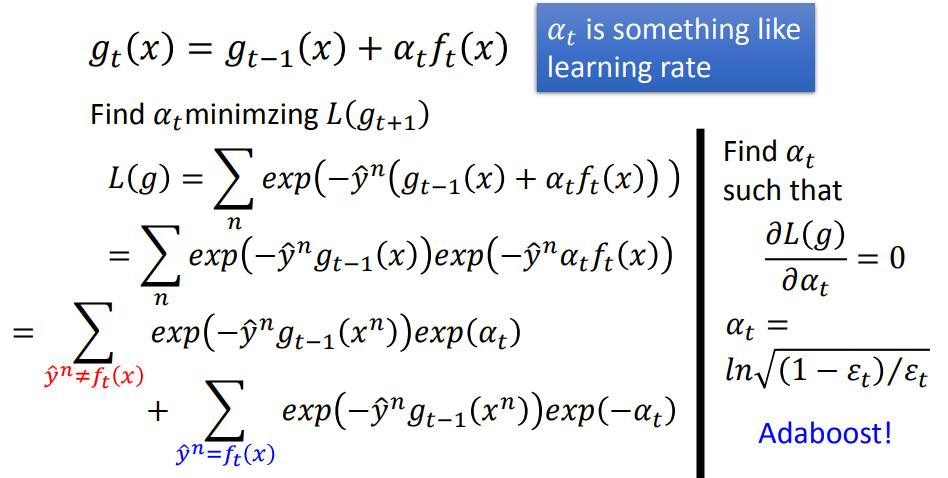

## 022-Ensemble

[022-Ensemble](https://www.youtube.com/watch?v=tH9FH1DH5n0&list=PLJV_el3uVTsPy9oCRY30oBPNLCo89yu49&index=32)  
[pdf](http://speech.ee.ntu.edu.tw/~tlkagk/courses/ML_2016/Lecture/Ensemble%20(v6).pdf)

团队合作 好几个模型一起上

多个 Classifier model 一起使用

### Bagging
解决overfitting问题

自己制造不同的data set??

从N笔data中可重复的抽取 N'笔数据生成新的data set （可以是N'=N）
这样得到几个模型，Testing 的时候，把x 通过每个模型得到output,然后做 Average/voting  

更 robust 不容易 overfitting  

regression -> Average  
classification -> voting   

<u>model 很复杂 容易overfitting，bias 很小 variance 很大</u>

Decidion Tree 很容易 overfitting，Random Forest 就是 Decision Tree 做Bagging 的版本  

**Decision Tree** 在每一个节点用一个数值判断产生分支 (有点像K-means 的感觉??)  
每个节点多少分支
用什么样的criterion做分支  
什么时候停止  

Random Forest 是在每一次产生branch 的时候都随机的决定哪一些feature 或问题是不用的。train 出多尔 Decision Tree 后再把他们的结果集合起来  

**out-of-bag** 可以不用把data 分为 training set 和 validation set，在Bagging中，可以把没有用到某一个data 的model bagging其来 作为test。

### Boosting
解决数据不足，模型匹配能力不足问题  
可以让50%错误率的模型组合起来，错误率为0  

按顺序train n 个 classifier model 每一个模型都和前一个是互补的  

相当于是用多个小模型来处理问题，每一个小模型都是能力不足不会overfitting的  

对于一个 ***classifier 的问题***  
给每一个train data 的 x <!--和 y--> 乘一个weight （把每一笔data 的位置随机缩放）  
(有点像VAE, auto encoder 的正太随机版，VAE 是根据正态分布扩散)  
(bagging的sampling方法也像是 整数倍的weight)  

怎么train 第二个model?  
生成第一笔data --> 训练f1() --> 找到 data2 能让f1() 的错误率为50% -> 训练f2()

初始化 weight 为 1

### adaboost  

<!--对加工过的 training data 做 error function 的偏微分。-->记 f1在training data 的 error rate 为 &epsilon;1，  &epsilon;1 = Lf1 | data 1

 是每一笔data 的weight  

classifier问题 在计算loss 时，要给每一个data 的loss 乘上对应那笔数据的 weight

然后除以weight 的总和做 normalization

然后<!-- 对 error function 做 training data 的 weight 的偏微分，-->调整 weight 找到 u2 让 f1的结果是烂的, 也就是让&epsilon;2 => 0.5

感觉就像在反向/描边

找到参数 d1 (d1 &gt; 1)

如果第n笔data 的结果 f1(x) 是<u>错</u>的 就让weight增大继续错  
u2 = u1 * d1 

如果第n笔data 的结果 f1(x) 是<u>对</u>的 就让weight减小 变对  
u2 = u1 / d1 

这时候 错误的数据一部分来自 之前的错误数据，一部分来自之前正确乘上d1 后变成错误的数据

&space;1" title="https://latex.codecogs.com/gif.image?\dpi{110}\bg{white}\\\therefore Z_1(1-\varepsilon_1)/d_1 = Z_1\varepsilon_1d_1 \\ d_1=\sqrt{(1-\varepsilon_1)/\varepsilon_1} > 1" />
 
 
或者表示为  

这样 对于结果正确的data  

对于结果错误的data  

最终  

反复运算得到T 个 classifier model ,增加拿所有模型的结果加起来判断正负就行  

错误率 &epsilon;t 越小，得到的 &alpha;t 就越大，也就是越烂的模型权重越小。&alpha;t可以理解为正确率/好模型率

decision stump (决策柱？？)

重点就是拿到准确率高的模型的weght

// todo Math 58'' 

### Boosting 推导

1式   
2式 

H(x) 的error rate 为  

令 即H(x) 符号函数 sign()里面那项 用 *-1来解决 y&#770; 和 f(x) 是否相同的问题

把上面1式的&alpha;带入

 即upper bound

d -> &delta; -> &alpha; 

3式 

4式 

这个大门符号表示嵌套运算？？？

把4式代入3式  

train data 的weight 和 和error 的 upper bound 有关  
现在要证明weight的和会越来越小  

第一项表示分类错误的数据，第二项表示分类正确的部分 &epsilon;就是error rate  
带入 &epsilon; 得到  

因为后面的 比1小 所以 Zt 会比 Zt-1 小  

**adaboost 特性** 在train data上总和的 error rate变为0后继续学习在 test data上的error rate还会下降  
adaboost 假设tain 的弱模型没有办法让error rate变0，否则会计算出错

 不断迭代可以让数据分布更远离边界（类似SVM的效果）  

**adaboost Decision Tree**

### Gradient Boosting

相比于adaboost，gradient boosting 会在每一步的f(x)都加上之前model 的总和。

找到 ft(x) &alpha;t 改善 gt-1(x)

怎么更新 ft(x) &alpha;t?   

也可以用 Gradient Descent 来算

用loss function 对 函数g 的偏微分来更新g,（对函数g的参数，整理的参数就是每个train data 乘的系数）  

希望 &alpha;tft(x) 和上面 Gradient 的梯度项 反向是一样的

要让左边的bossting 项 和右边的gradient 项反向越一致越好  

就是要两式相乘大于0  

即希望  同号， 前面的是一个weight： 

adabossting 这里面的 weak classifier ft 就是 gradient descent 里的负的 gradient  
  
在做 adabossting 时，每次获取ft 都要做一次Gradient Descent 的iteration过程。所以要在得到一个ft 后，固定 ft， 找到最好的 learning rate &alpha;t

可以定其他的 <u>Objective Function</u> 创造不一样 Bosting 的方法。

exp(-y&#770; * g(x))

### Stacking 

结合独立train 出来的而不同model , Majority Vote(多数投票)

或者 再把所有model 的output 接到一个 Classifier model 上 , 但是要把train data分一部分只用作 final classifier 的train data。因为前面的模型可能只是做 fit training data,能够检测出前面overfitting的情况 减少权重。
