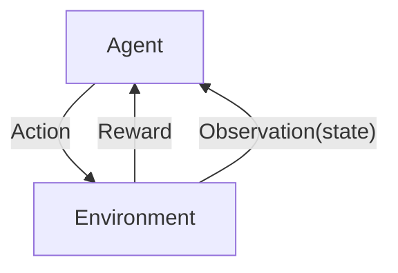

## 023-1 Deep Reinforcement Learning 会出现的问题 里rning  
- Reward delay 反馈是延时的

[02-1 Deep Reinforcement Learning](https://www.youtube.com/watch?v=W8XF3ME8G2I&list=PLJV_el3uVTsPy9oCRY30oBPNLCo89yu49&index=33)
[pdf](http://speech.ee.ntu.edu.tw/~tlkagk/courses/ML_2016/Lecture/RL%20(v6).pdf)

2015年2月 kreeger 在 Nature 上发了一篇 Reinforcement Learning 玩 Atari 的方法。  
16年 Alpha Go  

Agent: Observation(state) 观察到的 Environment,Action 影响环境  
Environment： 

胖dp, Part your observe,partial Observation State

在下围棋的例子中，中间的Action一直没有 Reward,最终赢的时候才会有反馈，机器要自己知道过程中哪几步是好的，哪几步是不好的  

positive reward/ negative reward

用在 chat-bot 上，两个机器自动对话，让后人再评估  
再加上Gan  

OpenAI [Gym](https://gym.openai.com) / [Universe](https://openai.com/blog/universe/)

### Playing Video Game

Space invader

荧幕画面的 pixels 就是 observation  

从游戏的开始到结束 是一个 episode

observation s1  
action a1  
reward r1  

**Reinforcement Learning 里的问题**  
- Reward delay 反馈是延时的
    - 要做不是直接产生奖励但是会影响后面的奖励的事情
    - 做一些现在是不利但是对之后是有利的事情
- exploration 探索

A3C

