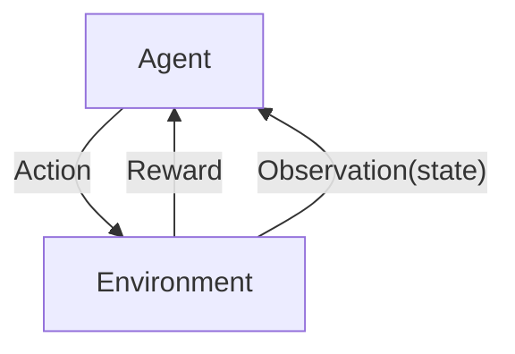
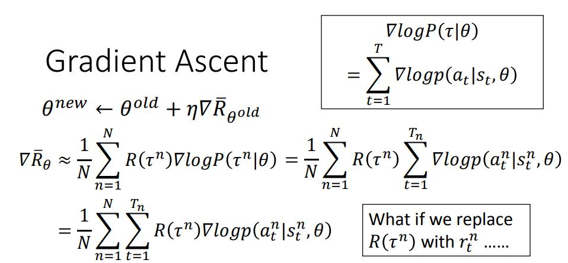

## 023-1 Deep Reinforcement Learning 会出现的问题 里rning  
- Reward delay 反馈是延时的

[02-1 Deep Reinforcement Learning](https://www.youtube.com/watch?v=W8XF3ME8G2I&list=PLJV_el3uVTsPy9oCRY30oBPNLCo89yu49&index=33)
[pdf](http://speech.ee.ntu.edu.tw/~tlkagk/courses/ML_2016/Lecture/RL%20(v6).pdf)

2015年2月 kreeger 在 Nature 上发了一篇 Reinforcement Learning 玩 Atari 的方法。  
16年 Alpha Go  

Agent: Observation(state) 观察到的 Environment,Action 影响环境  
Environment： 

胖dp, Part your observe,partial Observation State

在下围棋的例子中，中间的Action一直没有 Reward,最终赢的时候才会有反馈，机器要自己知道过程中哪几步是好的，哪几步是不好的  

positive reward/ negative reward

用在 chat-bot 上，两个机器自动对话，让后人再评估  
再加上Gan  

OpenAI [Gym](https://gym.openai.com) / [Universe](https://openai.com/blog/universe/)

### Playing Video Game

Space invader

荧幕画面的 pixels 就是 observation  

从游戏的开始到结束 是一个 episode

observation s1  
action a1  
reward r1  

**Reinforcement Learning 里的问题**  
- Reward delay 反馈是延时的
    - 要做不是直接产生奖励但是会影响后面的奖励的事情
    - 做一些现在是不利但是对之后是有利的事情
- exploration 探索

### outline
- Markov Decision Process (MDP)
- deep Q Network
- **A3C**

- Policy based 方法
    - Learning an Actor
- Value based 方法
    - Learning a Critic
- Actor-Critic 方法
    - Asynchronous Advantage Actor-Critic (A3C)

Model based 

[video lecture](https://videolectures.net) 

### Actor

Actor = &pi;( Observation ) => Action  
  NN network  
  
做Policy Gradient 时 认为output 是 stochastic 的,输出的是执行动作的机率,就算是同样的场景也会采取不同的动作    

Action 的函数 &pi; 的参数为 &theta;, 输入为state s  
a = &pi;&theta;(s) 

- 机器看见 observation s1
- 机器决定 action a1
- 机器获得反馈 reward r1
- 机器看见 observation s2
- 机器决定 action a2
- 机器获得反馈 reward r2

最后 Maximize Total Reward  

#### 如何评估Actor的好坏

Total reward: 

rt 是每次step单次的回报

模型每次的输出的是机率，同样的参数和情景也有可能输出不同的值，游戏本身也是随机的，所以R&theta; 是随机值。而我们要 MAximize RT 的期望

- 一场比赛的轨迹为序列&tau;，里边包含 观察状态 行动 回报
    - 
    - 所有的回报 
    - 一个游戏会有无数的过程，而model去玩游戏的时候只会看到很有限的一些过程，(还可能model很差，总是重复)

对于不同的Actor模型参数&theta;,某一种过程出现的机率：  
对于某个的参数&theta;，Actor模型的总回报期望为，某种轨迹的总回报乘以这种轨迹出现的期望 再累加起来。

让Actor去(重复的)玩N场游戏得到 {&tau;1,&tau;2,...,&tau;N}，就好像从 P(&tau; | &theta;) 中采样了 N 笔轨迹序列  
最后某一个参数为 &theta; 的模型，能够获得的期望就近似为重复n场比赛获得回报的平均。

用一个Actor 玩游戏生成序列，重复玩游戏作为training data, 得到平均回报用来评估，

(一笔data 里有几个轨迹序列)

#### 更新优化模型

Gradient Ascent:  

R(&tau;) 对于 &theta; 是个常量  
现在考虑怎么计算 P(&tau;|&theta;)  

,   
,  

其中 P(s1) 项 p(rt,st+1|st,at) 项是和 Actor的 &theta; 是无关的。  

**T**为一场比赛step 的次数  
**N**为多少场游戏

t 53"15'  

再某一场比赛轨迹 &tau;^n 中，在某次的观察状态 s_t^n 采取行动 a_t^n 后得到的机率是正的  
但是在式只中，某一点的机率是乘上整个轨迹&tau; 的 Reward R(&tau;n)   
为什么要取log? 在同样的轨迹下不能因为某种行为出现的概率更大而更优化这种情况，而忽略了出机率小但是得分可能更高的情况  

如果所有期望R(&tau;n)只有正的，没有惩罚怎么办？  
模型会让相同回报的行为出现的机率更平均。  

对于没出现过的情况 机率会减小 怎么处理？  
R(&tau;n) 减去一个bias (没有足够的收益就减小机率)

### Critic

从Critic 中得到一个Actor -> Q Learning

评估一个 observation 的状态有多好

Actor 和Critic 可以合在一起 train

MLDS  ??  

Actor Critic 可以得到什么， https://www.youtube.com/watch?v=nMR5mjCFZCw

VC-dimention

轩田
