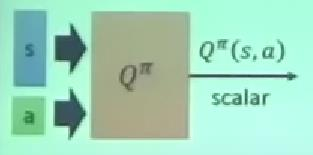
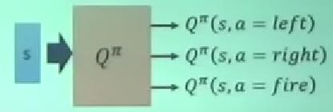

## 23-3 Reinforcement Learning (including Q-learning) 

[ML Lecture 23-3: Reinforcement Learning (including Q-learning)](https://www.youtube.com/watch?v=2-JNBzCq77c&list=PLJV_el3uVTsPy9oCRY30oBPNLCo89yu49&index=38)

与一般Machine Learning 不同的是机器输出的Action会影响到下一次观察到的环境状态  

alpha go

外界输入的资讯没有处理的叫 observation，给他归纳处理后叫做state  
但是机器处理能力越来越强，可以不用单独做归纳直接输入    

behavior cloning 复制行为

用supervised learning 的逻辑学习一个模型会有什么样的问题呢？  
会模仿无关结果的动作和错误的动作  
没法区分什么样的行为实际上是对结果有正面影响的  

要把所有的action 序列当作整体来看待  
解决方法：  
1. Reinforcement Learning // 强化学习  
2. learning by demonstration (inverse reinforcement learning ) // 演示学习  
  有一些专家行为的demo,通过特别的学习方式  

- Actor
- Critic
- Actor+Critic

### Reinforcement Learning

强化学习的3个结构
- Actor
- Environment // 固定的
- Reward function // 固定的 

每一场游戏从头到尾叫一个Episode  
把 s1,a1,s2,a2的序列统统记录起来， 叫一个 Trajectory  
把每一个 reward tt加 起来加 total reward R(&tau;)

过去的actor 是查表的，现在是 neural network  
(如何解决 non-linear 的问题)

如果要train 的问题中有未知的 不能微分的部分，就用 policy gradient  来一发  

### Critic

Critic 本身没有办法决定采取什么行动，而是根据环境状态s 和 模型输出的行动 a 来评估 action 有多好  

#### state value function
只考虑 state  

Critic 其中一种**state value function**: V&pi;(s)，对于给定Actor function \[&pi;\]，在当前看到的 state s 情况下，一直到游戏结束会得到的reward总和期望值有多大。  

- Monte-Carlo 蒙特卡洛
  已知 actor pi **经过state sa之后到游戏结束**，得到的累积reward 为Ga，  
  然后让actor pi学习输入state s 后输出 V&pi;(sa)，和Ga越接近越好  

- temporal-difference 时序差分  
  将 st,at,rt,st+1 作为一笔data，是把一个**step**拿来考虑。  
，  
  V&pi;(st) 还是从当前状态到游戏结束的累积奖励  

可以边玩边学

以上这两种可以给一个state 衡量到游戏结束可以得到多少reward,但是没法用来决定 Actor

<!-- ###  -->

#### state-action value function
考虑了state 和 action

**state-action value function** Q&pi;(s,a)

  

  
如果action 是可以穷举的，那么输入s 穷举使用可能的action  

Q function 可以找到一个比较好的 actor  

有一个初始的actor &pi;() 去和环境互动，Critic 通过观察当前actor的游戏序列来得到 Q function,(使用Monte-Carlo 或者 temporal-difference)， 然后通过Q function 来更新 Actor &pi;()。

 
**trick**  
[Rainbow: Combining Improvements in Deep Reinforcement Learning](https://arxiv.org/abs/1710.02298)

double DQN / Dueling DQN  

### actor+critic
Asynchronous Advantage Actor-Critic (A3C)   
精神是不看环境的随机性的 reward ,而是只跟critic 学  

有一个 global 的 actor 和 global 的 critic,然后复制参数到多个worker去玩游戏，每个的update 的方向汇总起来去update global 的actor和critic 

### Pathwise Derivative Policy Gradient

怎么处理连续输出的无法穷举的这类问题？  
acton 产生一个值 让critic 的值越大越好，有点像GAN。

### inverse reinforcement learning
是imitation learning 的一种  
作用 environment 和 actor , 没有 reward functio,只有expert demo trajectory  
没有明确的得分和评估方法，如对话等，实际情况里有没考到制定在规则里的情况。  
通过imitation learning 就可以按已有的行为方式行动  

通过 专家actor的数据 trajectory 和环境数据 使用 反向强化学习技术 来学习得到 Reward function  
再用得到的Reward function来找到好的actor

方向强化学习，可以用真实玩家的数据来帮助训练模型  

- 用expert 的记录和 actor 的记录 来生成一个 reward function, 评价这两个记录的分数，让expert 的分数更高  
- update actor 的参数，然他在这 reward function 上的分数和 expert 的一样好  
- 然后根据新的 actor 的记录 来更新 reward function，让reward 可以给 expert 更高的分数
- 这样循环

也很像GAN

### note

A3C 和 Q learn 的区别

