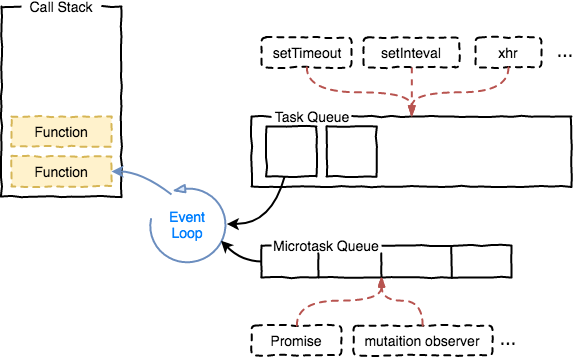

# p01-05 vue2源码剖析02

## vue 批量异步更新

- 浏览器事件循环

[zhihu Event Loop的规范和实现 ->](https://zhuanlan.zhihu.com/p/33087629)  


- Event Loop
    - Call Stack
    - Task Qtete 宏任务
        - setTimeout setInteval xhr(ajax)
    - Microtask Queue 微任务
        - Promist mutationObserver


1. 执行同步代码
2. 清空微任务队列
3. 执行一个宏任务
4. 循环2
5. 回到同步代码

nextTick (调用 flushSchedulerQueue)  
把watcher更新放到微任务中执行，在同步代码执行完后统一执行


### 时间循环demo
[Tasks, microtasks, queues and schedules](https://jakearchibald.com/2015/tasks-microtasks-queues-and-schedules/?utm_source=html5weekly)

promise 链式调用后面跟着的 then 会在 promise的resolve执行完(或者前一个them)才被加入到微任务栈中

```js
console.log('script start'); //1

setTimeout(function () {
  console.log('setTimeout'); // 5 然后执行宏任务
}, 0);

Promise.resolve()
  .then(function () {
    console.log('promise1'); // 3 先清空微任务
  })
  .then(function () {
    console.log('promise2'); // 4 先清空微任务
  });

console.log('script end'); // 2
```

### vue异步更新的实现
src\core\instance\init.js initState ->  
src\core\instance\state.js
src\core\observer\index.js

observe Observer defineReactive ->  
数值修改时触发set -> dep.notify()

```js
// src\core\observer\dep.js
export default class Dep {
  static target: ?Watcher;
  id: number;
  subs: Array<Watcher>;

  constructor () {
    this.id = uid++
    this.subs = []
  }

  notify () {
    // stabilize the subscriber list first
    const subs = this.subs.slice()
    if (process.env.NODE_ENV !== 'production' && !config.async) {
      // subs aren't sorted in scheduler if not running async
      // we need to sort them now to make sure they fire in correct
      // order
      subs.sort((a, b) => a.id - b.id)
    }
    for (let i = 0, l = subs.length; i < l; i++) {
      subs[i].update() // watcher.update()
    }
  }
}
```
```js
// src\core\observer\watcher.js

export default class Watcher {

  update () {
    /* istanbul ignore else */
    if (this.lazy) { // 计算属性触发
      this.dirty = true
    } else if (this.sync) { // watcher sync选项
      this.run()
    } else { // 一般情况
      queueWatcher(this)
    }
  }
}

```

```js
// src\core\observer\scheduler.js

export function queueWatcher (watcher: Watcher) { 
  const id = watcher.id
  //去重
  if (has[id] == null) {
    has[id] = true
    if (!flushing) { // 没有刷新队列
      queue.push(watcher)
    } else {
      // if already flushing, splice the watcher based on its id
      // if already past its id, it will be run next immediately.
      let i = queue.length - 1
      while (i > index && queue[i].id > watcher.id) {
        i--
      }
      queue.splice(i + 1, 0, watcher)
    }
    // queue the flush
    // 没有在等待
    if (!waiting) {
      waiting = true

      if (process.env.NODE_ENV !== 'production' && !config.async) {
        flushSchedulerQueue()
        return
      }
      // 就是$nextTick
      nextTick(flushSchedulerQueue)//尝试添加异步任务
    }
  }
}
```


## 虚拟DOM Diff算法


## --课上笔记--
<!-- Janus webrtc server -->

- 宏任务 task queue
    - setTimeout setInterval xhr
    - ajax
- 微任务 microtask queue
    - promise

https://jakearchibald.com/2015/tasks-microtasks-queues-and-schedules/?utm_source=html5weekly

watcher -> flushSchedulerQueue(微任务)


vue 首选微任务 (promise)

- **watch 批量执行实现**
- src\core\observer\scheduler.js
- src\core\observer\watcher.js
- src\core\util\next-tick.js

flushCallbacks
flushSchedulerQueue

nextTich的队列和watcher队列的执行

nextTich执行时机:
nextTich 在改值前注册会先执行， 以为这时队列是空的
nextTich 在改值后注册会在watcher执行后执行(正常的理解)

queueWatcher


- *虚拟dom*  
js对象

\src\core\instance\lifecycle.js  lifecycleMixin
\src\platforms\web\runtime\index.js \_\_patch\_\_


文件 方法 数据 效果
