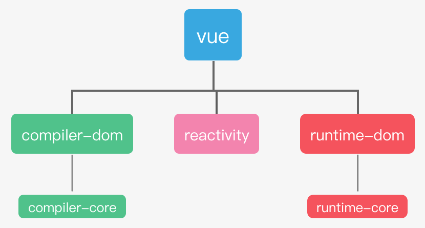

# p01-08 vue3源码剖析01

- 调试环境准备
- 初始化流程分析
- ⼿写实现
- ⾃定义渲染器实战

## 调试环境准备

```js
// vue2
import vue from 'vue'
new Vue({name:'xx'}).$mount("#qpp")

// vue3
import {cteateApp} from 'vue'
createApp({name:'xx'}).mount("#qpp")
```

```js
// vue.global.js // 打包文件
// vue公用api

```



### vue 打包命令介绍
```json
// package.json -> 
scripts:{
    "dev":"node scripts/dev.js --sourcemap"
}
```
```js
// scripts/dev.js
const execa = require('execa') // 命令行调用工具
const { exit } = require('process')
const { fuzzyMatchTarget } = require('./utils')
// 获得package.json scripts{} 命令行参数 构造为对象
const args = require('minisit')(process.argv.slice(2)) // 参数解析工具
// 打包模块 默认vue
const target = args._.length ? fuzzyMatchTarget(args._)[0] : 'vue'
// -xx 参数 -> args{} // xxx参数 -> aegs._.xxx
// 从参数对象获取标志
// 格式 cjs, global, esm
const formats = args.formats || args.f
// 源码映射
const sourceMap = args.sourcemap || args.s
const commit = execa.sync('git', ['rev-parse', 'HEAD']).stdout.slice(0, 7)


execa(
    'rollup',[ // row打包
        // ...
    ]
)

```

### rollup打包
```js
// rollup.config.js
  const entryFile = /runtime$/.test(format) ? `src/runtime.ts` : `src/index.ts`
```
```js
// src/index.js
export { compileToFunction as compile } // 编译器
export * from '@vue/runtime-dom'

```
```ts
// runtime-dom\src\index.ts
export const createApp = ((...args) => {
  // ensureRenderer() 返回一个单例渲染器
  const app = ensureRenderer().createApp(...args)
  
  //   ...
  return app
})
```
```ts
// runtime-core/src/renderer.ts
export function createRenderer<
  HostNode = RendererNode,
  HostElement = RendererElement
>(options: RendererOptions<HostNode, HostElement>) {
  return baseCreateRenderer<HostNode, HostElement>(options)
}


// baseCreateRenderer 函数重载


// implementation
function baseCreateRenderer(
  options: RendererOptions,
  createHydrationFns?: typeof createHydrationFunctions
): any {

  return {
    render, // 接收 (vdom, container)虚拟dom 和实际元素， 把vdom挂载到元素上
    hydrate, // 服务端渲染用 //将服务端给的html里注入交互方法??
    createApp: createAppAPI(render, hydrate) // vue初始化时用到的属性 // 创造一个cerateApp
  }
}
```

52:50 为什么不用构造函数，用工厂模式

```js
// packages\runtime-core\src\apiCreateApp.ts
// 通过参数配置生成 createApp 函数
// 闭包render hydrate参数
export function createAppAPI<HostElement>(
  render: RootRenderFunction,
  hydrate?: RootHydrateFunction
): CreateAppFunction<HostElement> {
  return function createApp(rootComponent, rootProps = null) {
  }
  
  const app: App = (context.app = { //实例方法

    use(plugin: Plugin, ...options: any[]) {
      return app
    },

    mixin(mixin: ComponentOptions) {
      return app
    },

    component(name: string, component?: Component): any {
      return app
    },

    directive(name: string, directive?: Directive) {
      return app
    },

    // 初始化
    mount(rootContainer: HostElement, isHydrate?: boolean): any {
    },

    unmount() {
    },

    provide(key, value) {
      return app
    }
  })
}
```

“副作用”定义为导入时执行特殊行为的代码 // 访问了函数外的数据


链式调用 独立 多实例(注册不同的插件，组件) 摇树优化  
多实例: 微前端


## 初始化流程分析
## ⼿写实现
## ⾃定义渲染器实战
 canvas图表
