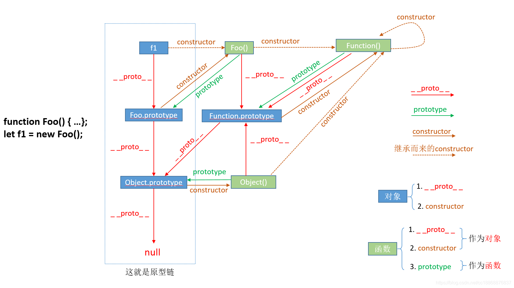

# 「面试必会」手写35道JS面试高频题
- [「面试必会」手写35道JS面试高频题(一)](https://juejin.im/post/6859026583533912072)
- [「面试必会」手写35道JS面试高频题(二)](https://juejin.im/post/6870043180444680200)

## 「面试必会」手写35道JS面试高频题(一)
### 1. 实现call/apply
1. 改变this指向 即使用传入的contex.fn执行
2. 执行
```js
Function.prototype.call=function(contex){
    contex = contex ? Object(contex) : window
    contex.fn = this // fun.call(this_) 中的fun
    let args = []
    for(let i=1; i<arguments.length; i++){
        args.push('arguments['+i+']')
    }

    let r = eval('contex.fn('+args+')')
    delete contex.fn
    return r
}

Function.prototype.apply = function(contex,args){
    contex = contex ? Object(contex) : window
    contex.fn = this
    
    let r = eval('contex.fn('+args+')')
    delete contex.fn
    return r
}

/**
主要是这两步 改变引用的来源(this)
    contex.fn = this
    let r = eval('contex.fn('+args+')')
*/

function f1(){
    console.log('f1',this.info)
}
function f2(){
    console.log('f2',this.info)
}
f2.info = '2333'

f1.call(f2)
// 相当于 f2.f1()

f1.call.call(f2)
// 相当于 f2.call() //这个call是前面的 //替换第一个call的引用来源


```

### 2. 实现bind方法
包装context的函数生成器
1. 绑定this 和参数
2. 返回绑定this的函数
3. 如果函数被new 那么当前函数的this就是产生的实例
4. new出来的实例要保证原函数的原型对象不丢失

```js
Function.prototype.bind = function(context){
    let that = this // 闭包存函数
    let bindArgs = Array.prototype.slice.call(arguments,1) //bind 参数部分

    function Fn(){} //继承原型用
    function fBound(){
        let args = Array.prototype.slice.call(arguments)
        // bind 函数是否被作为构造函数
        return that.apply(
            this instanceof fBound ? 
                this : // new 时的引用
                context, // 直接引用函数fn()或者通过属性引用函数.fn()
            bindArgs.concat(args)
        )
    }

    Fn.prototype = this.prototype//拷贝原型
    fBound.prototype = new Fn()//构造实例 继承原型
    return fBound
}
/**
1. this 闭包 apply替换 -> fnBound
2. 参数拼接
3. 原型构造 继承 -> Fn
*/

// 测试
a = {
    name:111,
    // fn(name){
    fn:function(name){
        this.name = name || this.name
        console.log(this.name)
    }
}
b={name:233}
fn1 = a.fn.bind(b)
fn1()//233
c={name:666}
c.fn1 = fn1
c.fn1()//233
d = new fn1(888)//888
d.fn1 = fn1
d.fn1()//233 这里就会有bug
```

### 3. 实现 new
1. 创建对象
2. 构造原型
3. 执行构造函数
4. 函数返回值为Object 返回这个返回值，否则返回构造的对象

```js
function mockNew(){
    let Constructor = [].shift.call(arguments)
    let obj = {}
    obj.__proto__=Constructor.prototype
    let r=Constructor.apply(obj,arguments)
    return r instanceof Object ? r : obj
}


```

### 4. 用es5实现数组map
```js
Array.prototype.map=function(fn){
    let r = []
    for(let i=0; i<this.length; i++){
        r.push(
            fn(this[i],i,this)
        )
    }
    return r
}

```

### 5. 用es5实现数组filter
...
### 6. 用es5实现数组some
...
### 7. 用es5实现数组every
...

### 8. 用es5实现数组find
...
### 9. 用es5实现数组forEach
...
### 10. 用es5实现数组reduce
...
### 11. 实现instanceof
```js
function instanceof_(obj,class_){
    let point = obj && obj.__proto__
    while(point){
        if(point === class_.prototype){
            return true
        }
        point = point.__proto__
    }
    return false
}

```


[JS中的prototype、__proto__与constructor](https://blog.csdn.net/cc18868876837/article/details/81211729)

### 12. 实现Object.create方法
创建新对象，用提供的对象作为新对象的__proto__

```js
function create(proto){
    function Fn(){}
    Fn.prototype = proto
    Fn.prototype.construction = Fn //还原构造函数
    return new Fn()
}

```

### 13. 实现一个通用柯里化函数
柯里化就是将一个函数的功能细化，把接受「多个参数」的函数变换成接受一个「单一参数」的函数，并且返回接受「余下参数」返回结果的一种应用。

1. 判断传递的参数是否达到执行函数的fn个数
2. 没有达到的话，继续返回新的函数，将fn函数继续返回并将剩余参数累加
3. 达到fn参数个数时，将累加后的参数传给fn执行

```js
function curring(fn,arr=[]){ // 第一次调用是数组形式 后面的调用是参数形式
    let flen = fn.length
    return function(){// 第一次固定返回闭包函数, 后面参数一满足条件立即执行
        let args = [...arr,...arguments]
        if(args.length < flen){
            return curring(fn,args)
        }else{
            return fn(...arr)
        }
    }
}

```


### 14. 实现一个反柯里化函数
使用call、apply可以让非数组借用一些其他类型的函数，比如，Array.prototype.push.call, Array.prototype.slice.call， uncrrying把这些方法泛化出来，不在只单单的用于数组
```js
Function.prototype.uncurring=function(){
    let that=this
    return function(){
        return Function.prototype.call.apply(that,arguments)
        //相当于 that.call(arguments)
        //相当于 args[0].that(args.splic(1))
    }
}
// 测试
forEach = Array.prototype.forEach.uncurring()
forEach($0.children,v=>console.log(v))
```
### 15. 实现节流函数(throttle)
- n秒内只执行一次
- 返回闭包返回一个函数包含节流逻辑

```js
function throttlet(fn,interval=5000){
    let t = null //lock
    let dArgs = null //lock期间 延迟执行的参数
    function tfn(...args){
        if(!t){ // 未设置定时器
            fn(...args)//立即执行
            dArgs = null //清空 不需要执行
            t=setTimeout(()=>{
                dArgs && fn(...dArgs)
                t=null
                dArgs = null
            },interval)
        }else{
            dArgs = args
        }
    }
    tfn.remove=function(){
        t && clearTimeout(t)
    }
    return tfn
}
//测试 
function fn(...args){
    console.log('haha',...args)
}
tfn = throttlet(fn)
tfn(1)
tfn(2)
tfn(3)
```
### 16. 消抖函数(debounce)
在事件被触发n秒后再执行回调，如果在这n秒内又被触发，则重新计时

```js
function debounce(fn,interval=5000){
    let t=null
    function dfn(...args){
        if(t){
            clearTimeout(t)
        }
        t = setTimeout(()=>{
            t=null
            fn(...args)
        },interval)
    }
    dfn.remove=function(){
        t && clearTimeout(t)
    }
    return dfn
}
function fn(...args){
    console.log('haha',...args)
}
dfn = debounce(fn)
dfn(1)
dfn(2)
dfn(3)

```

