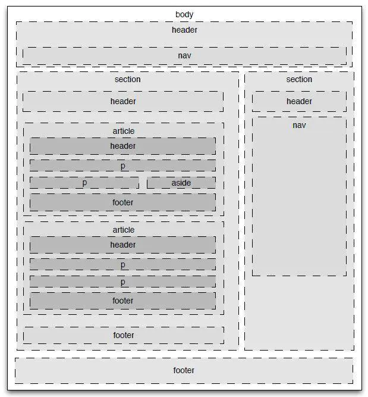

# 2021-04-09-面试整理

[log-2021-03-29.md](../../日志/2021/log-2021-03-29.md)

 1. 性能优化
 2. 为什么要把图片和css等静态资源放在单独的域名下
 3. 浏览器缓存
 4. HTTP 请求
 5. 输入URL后发生了什么

### splice()、slice()、split()区别
| 方法 | Array | String |
| :- | :- | :- |
| splice() | 数组删除或插入元素 | \ |
| slice() | 截取返回新数组 | 截取返回新字符串 |
| split() | \ | 分割字符串 |

### 原型继承
[原型继承](../../日志/2018-2019/log-2019-02-15.md)  
[11. 实现instanceof](./2020-09-10-35道JS面试高频题.md/#11_%20实现instanceof)

1. call parent
2. prototype
3. \_\_proto\_\_
4. \_\_proto\_\_.construet

```js
// PrimaryStudent构造函数:
function PrimaryStudent(props) {
    Student.call(this, props);
    this.grade = props.grade || 1;
}

// 空函数F:
function F() {
}

F.prototype = Student.prototype;
PrimaryStudent.prototype = new F();
PrimaryStudent.prototype.constructor = PrimaryStudent;

// 继续在PrimaryStudent原型（就是new F()对象）上定义方法：
PrimaryStudent.prototype.getGrade = function () {
    return this.grade;
};

// 创建xiaoming:
var xiaoming = new PrimaryStudent({
    name: '小明',
    grade: 2
});
xiaoming.name; // '小明'
xiaoming.grade; // 2


/*
## 子类构造函数中调用父类构造函数 Parent.call(this,...args)
## 子类的原创相当于父类的一个(空)实例，不执行实际的初始化函数，只有原先没有实例属性
空类(空函数)
同个原型 prototype
Child.prototype = new
Child.prototype.constructor = Parent
*/
```

### HTML5 语义化
https://www.jianshu.com/p/b226910034f2


- body
- header
    - nav
- section
    - header
    - article
        - p
        - aside
- footer

### HTTP 简单请求
https://blog.csdn.net/longgeqiaojie304/article/details/85270839

https://developer.mozilla.org/zh-CN/docs/Web/HTTP/Methods/OPTIONS 

**简单请求**
1. 方法为：GET HEAD POST
2. 请求header里面：   
    - 无自定义头  
    - Content-Type为以下几种：
        - text/plain
        - multipart/form-data
        - application/x-www-form-urlencoded

**非简单请求**
- put，delete方法的ajax请求
- 发送json格式的ajax请求
- 带自定义头的ajax请求


## 01 pft
### 1. 用flex布局实现手机app header body footer 上中下3栏布局
```html
<body>
    <header>
    </header>
    <section>
    </section>
    <footer>
    </footer>
</body>

```
```css
/*
display:flex-layout;
flex-direction：column/row;
flex-wrap:nowrap;
justify-content:center; // 轴向分布
align-items:stretch; // 正交对齐
align-content:stretch; // 整体对齐
*/
body{
    display:flex;
    flex-wrap:nowrap;
    flex-direction:column;
    justify-content:center;
    align-items:stretch;
    align-content:stretch;
    >*{
        min-width:0;
        min-height:0;
    }
}

header{
    flex:0 0 auto;
}
section{
    flex:1 1 auto;
}
footer{
    flex:0 0 auto;
}
```

### 2. 按下面测试用例实现createFlow  
```js
const delay=(ms)=>new Promise((resolve)=>setTimeout(resulve,ms));  
const subFlow = createFlow([()=>delay(1000).then(()=>log("c"))]);  
createFlow([
    ()=>log('a'),()=>log('b'),
    sufFlow,
    [()=>delay(1000).then(()=>log('d')),()=>('e')]
]).run(()=>{
    console.log("done")
})

//********************
let log = console.log
function createFlow(list){
    let result ={
        list,
    }
    async function runList (list){
        for(let index in list){
            let val = list[index]
            if(Array.isArray(val)){
                await runList(val)
            }else{
                await val()
            }
        }
    }
    result.run = async (cb)=>{
        await runList(this.list)
        cb()
    }
    return result
}

```

### 3. 实现new方法
```js
function myNew(){
    let constructor = [].shift.call(arguments)
    let obj = {}
    obj.__proto__ = constructor.prototype
    let r = constructor.apply(obj,arguments)
    return typeof(r)=='objet' ? r : obj
}
```

### 4. 简单实现js面向对象继承
```js
function Parent(...args){}

function Child(...args){
    Parent.call(this,...args)
    this.xxx = 'xxx'
}

function F(){}
F.prototype = Parent.prototype
Child.prototype = new F
Child.prototype.construetore = Parent

Child.prototype.fn = function (){}

new Child('xxxx')


```

### 5. 简单实现EventEmitter(订阅发布模式)
```js
class EventBus{
    constructor(){
        this.group={}
    }
    emit(event,...args){
        if(this.group[event]){
            this.group[event].forEach((v,i,a)=>{
                v(...args)
            })
        }
    }
    emit(event,fn){
        if(!this.group[event]){
            this.group[event] = []
        }
        this.group[event].push(fn)
    }
}
```

### 6. 实现bind方法
```js
Function.prototype.bind = function(context){
    let that = this
    let bindArgs = [].slice.call(arguments,1)

    function Fn(){}
    function fBound(){
        let args = [].slice.call(arguments)
        return that.call(
            this instanceof fBound ? this : that ,
            bindArgs.concat(args)
        )
    }
    Fn.protorype = this.prototype
    fBound.prototype = new Fn
    return fBound
}

/**
1. that bindArgs
2. Fn fBound
3. Fn.prototype fBound.prototype 
*/

```

### 7. 实现防抖
```js
function getDebounce(fn,ms){
    let th 
    return function(...args){
        if(!th){
            let that = this
            th = setTimeout(()=>{
                fn.call(that,...args)
                th = null
            },ms)
        }
    }
}
```

### 8. 以下代码输出什么
```js
for(var i=0;i<5;i++){
    console.log(i)
}

for(var s=0;i<s;s++){
    setTimeout(()=>{
        console.log(s)
    },100)
}
/*
0
1
2
3
4

5
5
5
5
5

*/
```


### 9. 以下代码输出什么
```js
setTimeout(function(){
    console.log(4)
},0)
new Promise(function(resolve){
    console.log(1)
    for(var i=0; i<1000; i++){
        i=9999 && resolve()
    }
    console.log(2)
}).then(function(){
    console.log(5)
})
console.log(3)

/*
12354
*/
```

### 10. js里0.1+0.2=? 为什么
0.29999 数据精度问题
双精度浮点数采用 64 位存储 (8 个字节)  
1位符号位  
11指数部分，即指数部分能表示的最大值是 2047（2^11-1）

https://www.zhoulujun.cn/html/theory/ComputerScienceTechnology/Constitution/2016_0714_7860.html

这两个边界值可以分别通过访问 Number 对象的 MAX_VALUE 属性和 MIN_VALUE 属性来获取：
```js
Number.MAX_VALUE; // 1.7976931348623157e+308
Number.MIN_VALUE; // 5e-324
```
如果数字超过最大值或最小值，JavaScript 将返回一个不正确的值，这称为 “正向溢出(overflow)” 或 “负向溢出(underflow)” 。 
```js
Number.MAX_VALUE+1 == Number.MAX_VALUE; //true
Number.MAX_VALUE+1e292; //Infinity
Number.MIN_VALUE + 1; //1
Number.MIN_VALUE - 3e-324; //0
Number.MIN_VALUE - 2e-324; //5e-324
```

## 02 zx
### 1. 鼠标点在一个链接上会触发哪些事件
mousedown
focus
mouseup
click

### 2. 'fxxixun666'.match(/\d/g)返回值是
 ["6", "6", "6"]

### 3. 根据css选择器优先级从高到低排序
a) .normal>.highlight b) div.normal>h1 c) #header>.highlight d)div#header>h1  

c d a b 

```html
    <div class="normal" id="header">
      <h1 class="highlight">
        2333
      </h1>
    </div>
```
```css
.normal>.highlight {
  color:#f88; /* 3 */
}
div.normal>h1 {
  color:#8f8; /* 4 */
}
#header>.highlight {
  color:#8ff; /* 1 */
}
div#header>h1{
  color:#88f; /* 2 */
}
```

### 4. RESTful里的PUT操作是用来<u>更新资源</u>
- PUT的幂等 数据替换
- POST是不可预知，所以将其定义为不安全、不幂等的Verb

### 5. js的模块化规范包含
AMD，CMD，commonJS，UMD，es6

[谈谈Js前端模块化规范](https://segmentfault.com/a/1190000015991869?utm_source=tag-newest)

### 6. promise的方法有哪些

- 静态方法
    - Promise.all(iterable)  
        全成功
    - Promise.allSettled(iterable)  
        全执行
    - Promise.any(iterable)  
        任意成功
    - Promise.race(iterable)  
        任意执行
    - Promise.reject(reason)  
        返回一个状态为失败的Promise对象，
    - Promise.resolve(value)  
        返回一个状态由给定value决定的Promise对象。
- 原型方法
    - catch(onRejected)  
        添加一个拒绝(rejection) 回调
    - then(onFulfilled, onRejected)  
        添加解决(fulfillment)和拒绝(rejection)回调
    - finally(onFinally)
        添加一个事件处理回调于当前promise对象

### 7. 状态码
https://www.runoob.com/http/http-status-codes.html

- 200 * (OK) - 表示已在响应中发出
- 204 (无内容) - 资源有空表示 put不更新页面 https://developer.mozilla.org/en-US/docs/Web/HTTP/Methods/OPTIONS 复杂请求cros跨域鉴权

- 300 * (multiple choices) - 多种选择。请求的资源可包括多个位置，相应可返回一个资源特征与地址的列表用于用户终端(例如：浏览器)选择
- 301 (Moved Permanently) - 永久重定向 资源的URI已被更新
- 302 * 暂时重定向 安全问题 搜索引擎分流 (浏览器重发post 或转get)
- 303 * (See Other) - 其他(如，负载均衡) (定义浏览器把post转get)
- 304 * (not modified) - 资源未更改(缓存)
- 305 * 使用代理
- 307 * 跳转Location的URI (定义浏览器 post不转get)

- 400 * (bad request) - 指代坏请求(如，参数错误)
- 401 * (unauthorized) - 请求要求用户的身份认证
- 403 * (forbidden) -	服务器理解请求客户端的请求，但是拒绝执行此请求 没有权限
- 404 * (not found)- 资源不存在
- 503 * (service Unavailable)	由于超载或系统维护

### 8. 常见设计模式
[JavaScript中常用的设计模式](https://segmentfault.com/a/1190000017787537)

<table>
<tbody><tr>
<th>模式分类</th>
<th>名称</th>
</tr>
<tr>
<td rowspan="3">创建型</td>
<td><a href="https://github.com/sunzhaoye/blog/blob/master/designPattern/%E5%B7%A5%E5%8E%82%E6%A8%A1%E5%BC%8F.md" rel="nofollow">工厂模式</a></td>
</tr>
<tr>
<td><a href="https://github.com/sunzhaoye/blog/blob/master/designPattern/%E5%8D%95%E4%BE%8B%E6%A8%A1%E5%BC%8F.md" rel="nofollow">单例模式</a></td>
</tr>
<tr>
<td><a href="https://github.com/sunzhaoye/blog/blob/master/designPattern/%E5%8E%9F%E5%9E%8B%E6%A8%A1%E5%BC%8F.md" rel="nofollow">原型模式</a></td>
</tr>
<tr>
<td rowspan="2">结构型</td>
<td><a href="https://github.com/sunzhaoye/blog/blob/master/designPattern/%E9%80%82%E9%85%8D%E5%99%A8%E6%A8%A1%E5%BC%8F.md" rel="nofollow">适配器模式</a></td>
</tr>
<tr>
<td><a href="https://github.com/sunzhaoye/blog/blob/master/designPattern/%E4%BB%A3%E7%90%86%E6%A8%A1%E5%BC%8F.md" rel="nofollow">代理模式</a></td>
</tr>
<tr>
<td rowspan="5">行为型</td>
<td><a href="https://github.com/sunzhaoye/blog/blob/master/designPattern/%E7%AD%96%E7%95%A5%E6%A8%A1%E5%BC%8F.md" rel="nofollow">策略模式</a></td>
</tr>
<tr>
<td><a href="https://github.com/sunzhaoye/blog/blob/master/designPattern/%E8%BF%AD%E4%BB%A3%E5%99%A8%E6%A8%A1%E5%BC%8F.md" rel="nofollow">迭代器模式</a></td>
</tr>
<tr>
<td><a href="https://github.com/sunzhaoye/blog/blob/master/designPattern/%E8%A7%82%E5%AF%9F%E8%80%85%E6%A8%A1%E5%BC%8F.md" rel="nofollow">观察者模式(发布-订阅模式)</a></td>
</tr>
<tr>
<td><a href="https://github.com/sunzhaoye/blog/blob/master/designPattern/%E5%91%BD%E4%BB%A4%E6%A8%A1%E5%BC%8F.md" rel="nofollow">命令模式</a></td>
</tr>
<tr>
<td><a href="https://github.com/sunzhaoye/blog/blob/master/designPattern/%E7%8A%B6%E6%80%81%E6%A8%A1%E5%BC%8F.md" rel="nofollow">状态模式</a></td>
</tr>
</tbody></table>


## 03 gw

#### 1. px em rem 区别
像素 行高 根行高

#### 2. js异步加载
[js的异步加载](https://zhuanlan.zhihu.com/p/133866906)
[JS异步加载的三种方式](https://blog.csdn.net/l522703297/article/details/50754695)

webpack打包后这些方法都比较少用了  
webpack里面也差不多是eval执行字符串

1. 同步加载
``html
<script src="http://yourdomain.com/script.js"></script>
```
同步/阻塞模式，会阻止浏览器继续解析  
所以一般建议把<script>标签放在<body>结尾处，这样尽可能减少页面阻塞。

2. 异步加载

1. defer 异步加载，但要等到dom文档全部解析完才会被执行。只有IE能用，也可以将代码写到内部。
```html
<script src="http://yourdomain.com/script.js" defer></script>
<script defer>
console.log(666)
</script>
```
2. async 异步加载，加载完就执行，async只能加载外部脚本文件
``html
<script src="http://yourdomain.com/script.js" async></script>
```

3. 脚本插入script 标签，script.onload script.onreadystatechange 触发执行
Script DOM Element

```html
</head>
<body>
<div>123</div>
<script>
    function loadScript(url, callback){
        let script = documents.createElement( 'script' )
        if (script.readyState){
            script.onreadystatechange = function(){
                if (script.readyState =='complate' || script.readyState =='loaded' ) {
                    tools[callback]();
                }
            }
        } else{
            script.onload = function(){
                //safari chrome firefox opera兼容
                tools[callback]();
            }
        }
        script.src = url
        document.body.appendChild(script)
    }
    loadScript( 'tools.js','test');
</script>
```
```js
let tools={
    test:function(){
        console.log('test fn')
    }
}
```
XHR Injection、 XHR Eval、 Script In Iframe、 Script defer属性、 document.write(script tag)。

1. 插入script.href标签
2. 请求js文本直接插入script标签
3. 请求后用eval执行
4. 插入iframe执行？？
5. 加载注释的代码 然后eval执行

#### 8. title 和 h1 区别
&lt;title>标签表示的标题是整个网页的名字在&lt;header>里面，即在浏览器顶部的tab栏里显示的。
&lt;h1>标签是网页内容的标题

#### 9. src和href的区别
href标识超文本引用，用在link和a等元素上，href是引用和页面关联，是在当前元素和引用资源之间建立联系
src表示引用资源，表示替换当前元素，用在img，script，iframe上，src是页面内容不可缺少的一部分。

&lt;script src="js.js">&lt;/script>当浏览器解析到这一句的时候会暂停其他资源的下载和处理，直至将该资源加载，编译，执行完毕，图片和框架等元素也是如此，类似于该元素所指向的资源嵌套如当前标签内，这也是为什么要把js饭再底部而不是头部。

&lt;link href="common.css" rel="stylesheet"/>当浏览器解析到这一句的时候会识别该文档为css文件，会下载并且不会停止对当前文档的处理，这也是为什么建议使用link方式来加载css而不是使用@import。

两者都是外部引用CSS的方式，但是存在一定的区别：
区别1：link是XHTML标签，除了加载CSS外，还可以定义RSS等其他事务；@import属于CSS范畴，只能加载CSS。
区别2：link引用CSS时，在页面载入时同时加载；@import需要页面网页完全载入以后加载。
区别3：link是XHTML标签，无兼容问题；@import是在CSS2.1提出的，低版本的浏览器不支持。
区别4：ink支持使用Javascript控制DOM去改变样式；而@import不支持。

#### 10. css盒子模型
- margin
- border
- padding
- content

#### 11. web storage 和coockie区别
- coockie 当设定一个cookie之后再给创建它的域名发送请求时，都会包含这个cookie，限制4k
- webStorage 本地存储不过期 限制5M

- sessionStorage
    - 以域名为单位进行数据划分
    - 对数据的改动会导致同时共享这些数据的其他页面触发storage事件

- localStorage
    - 以每个“顶级页面（top-level browsing context）”为单位
    - 对数据的改动会触发storage事件

都拥有setItem,getItem,removeItem,clear等方法


1. 大小是受限的，
2. 请求一次新的页面的时候,cookie都会被发送过去,这个无形中浪费了带宽。
3. cookie是需要指定作用域的，是不可以跨域调用的。
4. 纯文本，需要前端开发自己封装setCookie,getCookie
5. cookie数据还有路径（path）的概念，可以限制。cookie只属于某个路径下 ";path = /xxx"
6. cookie存在安全性问题。如果cookie被人拦截了，那人就可以取得所有的session信息。

//todo 跨跨域发送koockie问题


//////////////////////
yzg
#### webpack打包过程  
https://webpack.docschina.org/concepts/under-the-hood/#chunks
指处理某些文件并将其输出为其他文件的能力。  
项目中使用的每个文件都是一个 模块  
通过互相引用，这些模块会形成一个图(ModuleGraph)数据结构。  
在打包过程中，模块会被合并成 chunk。 chunk 合并成 chunk 组，并形成一个通过模块互相连接的图(ModuleGraph)。 
parser 处理 ??

1. 多个entry会创建多个chunk组，
2. 通过import('./app.jsx')引入的模块会创建 non-initial chunk动态载入 默认没有名称
- initial(初始化) 是入口起点的 main chunk。此 chunk 包含为入口起点指定的所有模块及其依赖项。
- non-initial 是可以延迟加载的块。可能会出现在使用 动态导入(dynamic imports) 或者 SplitChunksPlugin 时。


#### vue数组直接改索引不会更新  
#### css实现排序  
```css
.order1{
    order:1
}
.order2{
    order:2
}
```
#### Vue 的响应式原理中 Object.defineProperty 有什么缺陷？  
https://www.cnblogs.com/wangxi01/p/11225555.html
- Object.defineProperty只能劫持对象的属性，从而需要对每个对象，每个属性进行需要深度遍历。Proxy可以劫持整个对象，并返回一个新的对象。
- Proxy可以代理 对象 / 数组， 可以动态增加属性


#### 页面数据多怎么优化
分批加载 渲染
[面对数据量大的情况如何进行优化？](https://www.zhihu.com/question/267560156)


- 按需加载
- 首屏数据
- 缓存数据

- 传输问题
- 前端数据处理
- 页面渲染

保证效果的前提下预聚合(从传输到渲染之前) 地理位置数据可以用geohash来聚合
按需加载
动静分离
异步加载

